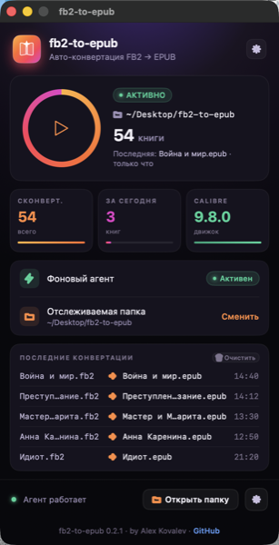
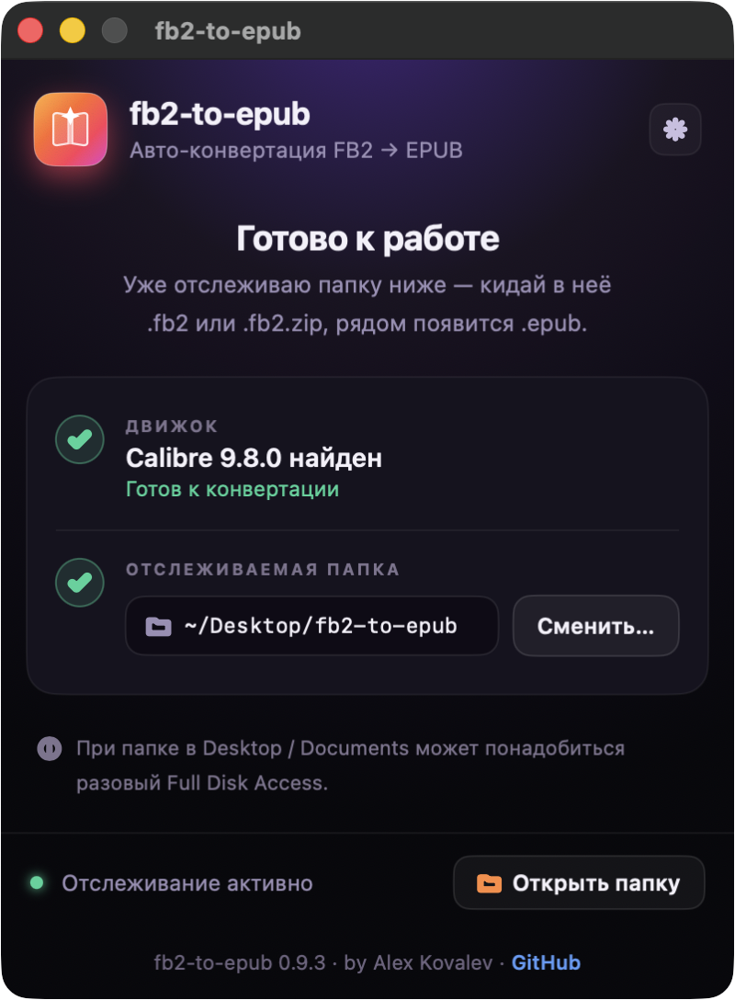

# fb2-to-epub

**Русский** · [English](README.en.md)


Автоматическая конвертация **FB2 → EPUB** на macOS по выбранной папке. Установил приложение, указал папку — дальше просто кидаешь в неё `.fb2` / `.fb2.zip` / папки с книгами, и рядом появляются готовые `.epub`. Установка и статус — в аккуратном нативном окне; сама конвертация идёт фоном, без ручных запусков.

## Интерфейс

<p align="center">
  
  &nbsp;&nbsp;
  
  &nbsp;&nbsp;
  
</p>

<p align="center"><sub><b>Статус</b> · <b>Установка</b> · <b>Выбор обложки</b></sub></p>

## Установка (основной путь — DMG)

1. Скачай `fb2-to-epub-<версия>.dmg` со страницы **[Releases](https://github.com/ArrivaRUS/fb2-to-epub/releases)**.
2. Открой `.dmg` и перетащи приложение **fb2-to-epub** в папку **«Программы»** (Applications) — стрелка на фоне окна показывает куда.
3. **Первый запуск** (один раз): открой папку «Программы», **правый клик** на `fb2-to-epub` → **«Открыть»** → в диалоге подтверди **«Открыть»**.
   *Альтернатива:* запусти приложение, затем **Системные настройки → Конфиденциальность и безопасность → «Открыть всё равно»**.
   Приложение собрано без платной подписи Apple, поэтому macOS просит подтверждение — это разовый шаг, дальше оно запускается обычным двойным кликом.
4. Приложение проверит, что установлен **Calibre** (если нет — предложит открыть страницу загрузки), затем предложит **выбрать папку** для отслеживания. По умолчанию — `~/Desktop/fb2-to-epub` (создаётся автоматически).
5. Готово. Появится экран с указанием выбранной папки и кнопкой **«Open Folder»**.

Дальше кидай в выбранную папку:

- **отдельный файл** `*.fb2` или `*.fb2.zip` → рядом появится файл с тем же именем и расширением `.epub`;
- **папку с книгами** (любая вложенность) → рядом создаётся папка-зеркало с суффиксом `-epub`, в которой воссоздана структура подкаталогов с готовыми `.epub`.

Исходники не трогаются. Повторные срабатывания идемпотентны — уже сконвертированное пропускается (`.epub` считается актуальным, если он новее источника).

## Full Disk Access (если папка в Desktop / Documents / Downloads)

`~/Desktop`, `~/Documents` и `~/Downloads` — защищённые macOS зоны (TCC). На чистом Mac фоновому агенту может понадобиться **разовый** доступ к ним. Если файлы перестали конвертироваться (или не начали вовсе) — выдай Full Disk Access **раннеру**:

1. **Системные настройки → Конфиденциальность и безопасность → Полный доступ к диску** (Full Disk Access).
2. Нажми **«+»**, в открывшемся выборе нажми **Cmd-Shift-G** и вставь путь:
   ```
   ~/Library/Application Support/fb2-to-epub/bin/fb2-to-epub-runner.sh
   ```
3. Добавь его и **включи переключатель**.

Доступ привязан именно к этому файлу и сохраняется при обновлениях приложения. Установщик печатает точный путь раннера в конце установки.

> Почему именно раннер: macOS привязывает право доступа к файлам не к скрипту, а к исполняемому файлу, указанному в `ProgramArguments` агента. Поэтому у агента есть стабильная «ответственная» цель по фиксированному пути (`fb2-to-epub-runner.sh`), которой можно выдать доступ один раз.

## Требования

- **macOS** (11.0+).
- **[Calibre](https://calibre-ebook.com)** — нужны `/Applications/calibre.app/Contents/MacOS/ebook-convert` и `ebook-meta`.
  Установка: `brew install --cask calibre` или [скачать с сайта](https://calibre-ebook.com/download_osx).
- **`python3`** — входит в Xcode Command Line Tools (`xcode-select --install`). Используется только для поиска обложек, без сторонних зависимостей.

## Как работает

- macOS `launchd` отслеживает выбранную папку через `WatchPaths`. Агент: `com.arrivarus.fb2toepub.agent`.
- При появлении новых файлов агент запускает **runner** (`fb2-to-epub-runner.sh`, FDA-цель), который exec'ает **watcher** (`fb2-to-epub-watcher.sh`).
- Watcher конвертирует книги через [Calibre](https://calibre-ebook.com) (`ebook-convert`, `ebook-meta`).
- Поиск обложек делает `fb2-to-epub-cover-finder.py` (Python 3, без сторонних зависимостей).
- Абсолютные пути к `ebook-convert` и `python3` передаются агенту через `EnvironmentVariables` (агент стартует с голым `PATH`).
- `ThrottleInterval=5s` сглаживает пакетное копирование; lock-каталог в `/tmp` сериализует параллельные запуски.

Скрипты живут в `~/Library/Application Support/fb2-to-epub/bin/`, конфиг агента — в `~/Library/LaunchAgents/com.arrivarus.fb2toepub.agent.plist`, лог — в `~/Library/Logs/fb2-to-epub.log`.

## Управление

| Действие | Команда |
| --- | --- |
| Логи в реальном времени | `tail -f ~/Library/Logs/fb2-to-epub.log` |
| Остановить агент | `launchctl bootout gui/$(id -u)/com.arrivarus.fb2toepub.agent` |
| Запустить агент | `launchctl bootstrap gui/$(id -u) ~/Library/LaunchAgents/com.arrivarus.fb2toepub.agent.plist` |
| Перезапустить / прогнать вручную | `launchctl kickstart -k gui/$(id -u)/com.arrivarus.fb2toepub.agent` |
| Сменить отслеживаемую папку | Запусти приложение **fb2-to-epub** ещё раз и выбери новую папку (переустановка идемпотентна) |
| Удалить | Используй `./uninstall.sh` из репозитория (CLI-путь ниже) |

## Обработка обложек

- Если в FB2 есть встроенная обложка — Calibre использует её.
- Если обложки нет — скрипт ищет её онлайн по title + author. Источники:
  1. [Open Library](https://openlibrary.org) — каталог-API; быстрый и стабильный, но скудный по русским изданиям.
  2. [DuckDuckGo Images](https://duckduckgo.com) — широкий image search; на русских запросах надёжно вытаскивает обложки с labirint.ru, ozon.ru, knijky.ru и подобных.

  Результаты двух источников объединяются и проверяются по очереди. Кандидат принимается только если скачанная картинка похожа на обложку: соотношение сторон в диапазоне 1.0–2.5 (height/width) и ширина не меньше 200 px. Это отсекает фотографии авторов, миниатюры и квадратные логотипы.
- **Несколько подходящих вариантов → выбор в приложении.** Если найдено **2 и более** подходящих обложки, лучшая ставится сразу (не задерживая конвертацию), а книга попадает в очередь **«Выбрать обложку»** в окне приложения. Там можно открыть эту очередь, посмотреть найденные варианты с превью и **выбрать другой** — выбранная обложка будет **перезаписана в уже готовый `.epub`** (это делает фоновый агент через Calibre). Можно оставить авто-выбор или пропустить. Всё происходит в окне, без всплывающих окон поверх работы.
- Если интернет недоступен или ничего подходящего не нашлось — EPUB собирается без обложки (дефолтная серая заглушка Calibre подавлена флагом `--no-default-epub-cover`).

## Продвинутый путь — установка из CLI

Для разработчиков и тех, кто предпочитает терминал. Минует приложение и DMG — ставит тот же агент тем же установщиком (`packaging/installer.sh`).

```sh
# 1. Calibre (если ещё нет)
brew install --cask calibre

# 2. Клонировать и установить
git clone https://github.com/ArrivaRUS/fb2-to-epub.git
cd fb2-to-epub
./install.sh                       # папка по умолчанию ~/Desktop/fb2-to-epub
./install.sh "/path/to/my folder"  # или своя папка
```

Удаление: `./uninstall.sh` (снимает агент и удаляет установку из App Support; выбранная папка и сконвертированные файлы остаются).

## Сборка из исходников

Артефакты (`*.app`, `*.dmg`, `build/dist/`) в `.gitignore` — бинарники не коммитятся, `.dmg` уходит в GitHub Release.

```sh
# 1. приложение: dist/fb2-to-epub.app (osacompile + иконка + ad-hoc codesign)
build/build-app.sh [версия]

# 2. DMG: build/dist/fb2-to-epub-<версия>.dmg (+ .sha256)
brew install create-dmg            # нужен Homebrew create-dmg (andreyvit)
build/make-dmg.sh [версия]
```

`build-app.sh` собирает `.app` из AppleScript-апплета (`packaging/applet.applescript`), кладёт `installer.sh` + watcher + cover-finder + runner в `Contents/Resources`, строит иконку из `branding/icon-app.svg` (full-bleed под macOS 26) и явно прописывает `CFBundleIdentifier=com.arrivarus.fb2toepub` (стабильный id важен, чтобы TCC-гранты не слетали при пересборке). `make-dmg.sh` упаковывает `.app` + симлинк `/Applications` + фон с инструкцией первого запуска.

## Лицензия

[MIT](LICENSE)
