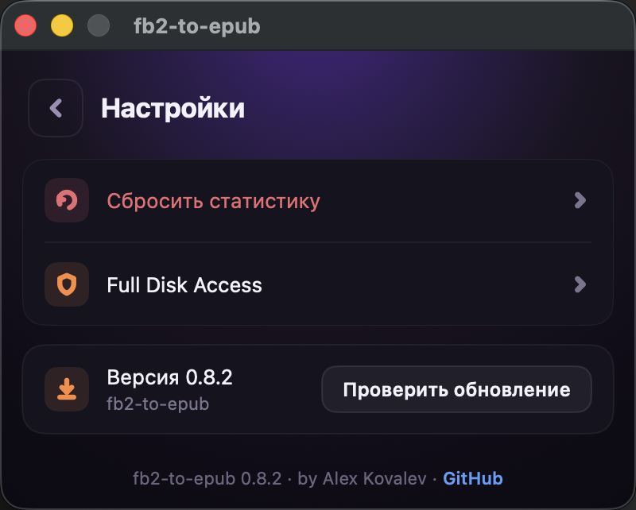

# fb2-to-epub

**Русский** · [English](README.en.md)


Автоматическая конвертация **FB2 → EPUB** на macOS по выбранной папке. Установил приложение, указал папку — дальше просто кидаешь в неё `.fb2` / `.fb2.zip` / `.fb3` / папки с книгами, и рядом появляются готовые `.epub`. Установка и статус — в аккуратном нативном окне; сама конвертация идёт фоном, без ручных запусков.

## Интерфейс

<p align="center">
  
  &nbsp;&nbsp;
  
  &nbsp;&nbsp;
  
  &nbsp;&nbsp;
  
</p>

<p align="center"><sub><b>Статус</b> · <b>Установка</b> · <b>Настройки</b> · <b>Выбор обложки</b></sub></p>

Приложение нативное (SwiftUI), окно фиксированной ширины 400px, тёмная тема. Четыре экрана: **Установка** (первый запуск), **Статус**, **Настройки** и **Выбор обложки**.

## Возможности

- **Авто-конвертация по папке.** Указываешь одну папку — фоновый агент сам ловит новые файлы и конвертирует их, без ручных запусков. Отдельный файл `*.fb2` / `*.fb2.zip` / `*.fb3` → рядом появляется `.epub`; папка с книгами (любая вложенность) → рядом создаётся папка-зеркало с суффиксом `-epub`. Исходники не трогаются, повторные срабатывания идемпотентны (актуальное пропускается).
- **Live-статус.** Кольцо-прогресс заливается по часовой по мере конвертации пачки и показывает 100%, когда всё готово (в центре — счётчик «сделано / всего», пока пачка идёт). Рядом — счётчики «всего» и «за сегодня», версия Calibre, статус фонового агента (работает / на паузе), отслеживаемая папка, список последних конвертаций и кнопка **«Открыть папку»**. Всё обновляется событийно, без ручного «обновить».
- **Авто-всплытие окна.** Когда стартует новая пачка конвертаций, окно само выходит на передний план — видно, что процесс пошёл.
- **Встроенный авто-апдейт.** **⚙ Настройки → «Проверить обновление»** скачивает и ставит новую версию приложения; фоновый агент при этом обновляется автоматически.
- **Экран настроек.** Сбросить статистику · Full Disk Access · версия приложения + «Проверить обновление». Авторство и ссылка на GitHub — внизу экрана.
- **Сброс статистики.** Обнуляет «всего», «за сегодня» и список последних конвертаций (сами `.epub`-файлы не трогает).
- **Умные обложки.** Если в FB2 нет обложки — приложение ищет её онлайн, даёт выбрать из найденных вариантов, защищает от чужих обложек по названию и, если в сети ничего не нашлось, рисует красивую типографскую обложку само (подробно — в разделе [«Обработка обложек»](#обработка-обложек)).

## Установка (основной путь — DMG)

1. Скачай `fb2-to-epub-<версия>.dmg` со страницы **[Releases](https://github.com/ArrivaRUS/fb2-to-epub/releases)**.
2. Открой `.dmg` и перетащи приложение **fb2-to-epub** в папку **«Программы»** (Applications) — стрелка на фоне окна показывает куда.
3. **Первый запуск** (один раз): открой папку «Программы», **правый клик** на `fb2-to-epub` → **«Открыть»** → в диалоге подтверди **«Открыть»**.
   *Альтернатива:* запусти приложение, затем **Системные настройки → Конфиденциальность и безопасность → «Открыть всё равно»**.
   Приложение собрано без платной подписи Apple, поэтому macOS просит подтверждение — это разовый шаг, дальше оно запускается обычным двойным кликом.
4. Приложение проверит, что установлен **Calibre** (если нет — предложит открыть страницу загрузки), затем предложит **выбрать папку** для отслеживания. По умолчанию — `~/Desktop/fb2-to-epub` (создаётся автоматически).
5. Готово. Появится экран «Готово к работе» с указанием выбранной папки и кнопкой **«Открыть папку»**.

Дальше кидай в выбранную папку:

- **отдельный файл** `*.fb2`, `*.fb2.zip` или `*.fb3` → рядом появится файл с тем же именем и расширением `.epub`;
- **папку с книгами** (любая вложенность) → рядом создаётся папка-зеркало с суффиксом `-epub`, в которой воссоздана структура подкаталогов с готовыми `.epub`.

Исходники не трогаются. Повторные срабатывания идемпотентны — уже сконвертированное пропускается (`.epub` считается актуальным, если он новее источника).

## Full Disk Access (если папка в Desktop / Documents / Downloads)

`~/Desktop`, `~/Documents` и `~/Downloads` — защищённые macOS зоны (TCC). На чистом Mac фоновому агенту может понадобиться **разовый** доступ к ним. Если файлы перестали конвертироваться (или не начали вовсе) — выдай Full Disk Access **раннеру**:

1. **Системные настройки → Конфиденциальность и безопасность → Полный доступ к диску** (Full Disk Access).
2. Нажми **«+»**, в открывшемся выборе нажми **Cmd-Shift-G** и вставь путь:
   ```
   ~/Library/Application Support/fb2-to-epub/bin/fb2-to-epub-runner.sh
   ```
3. Добавь его и **включи переключатель**.

Доступ привязан именно к этому файлу и сохраняется при обновлениях приложения. Установщик печатает точный путь раннера в конце установки. Быстрый переход к нужной панели есть и в самом приложении: **⚙ Настройки → Full Disk Access**.

> Почему именно раннер: macOS привязывает право доступа к файлам не к скрипту, а к исполняемому файлу, указанному в `ProgramArguments` агента. Поэтому у агента есть стабильная «ответственная» цель по фиксированному пути (`fb2-to-epub-runner.sh`), которой можно выдать доступ один раз.

## Требования

- **macOS** (11.0+).
- **[Calibre](https://calibre-ebook.com)** — нужны `/Applications/calibre.app/Contents/MacOS/ebook-convert` и `ebook-meta`.
  Установка: `brew install --cask calibre` или [скачать с сайта](https://calibre-ebook.com/download_osx).
- **`python3`** — входит в Xcode Command Line Tools (`xcode-select --install`). Используется для поиска обложек в сети и для трансляции `.fb3` → FB2, без сторонних зависимостей.

> Поддержка `.fb3` **не требует новых зависимостей** — по-прежнему достаточно Calibre + `python3`.

## Обработка обложек

Приложение старается, чтобы у каждой книги была обложка, и при этом не подсовывает чужую.

- **Встроенная обложка.** Если в FB2 уже есть обложка — Calibre использует её, без поиска.
- **Поиск в сети.** Если обложки нет — приложение ищет её онлайн по автору + названию. Источники:
  1. [Open Library](https://openlibrary.org) — каталог-API; быстрый и стабильный, но скудный по русским изданиям.
  2. [DuckDuckGo Images](https://duckduckgo.com) — широкий image search; на русских запросах надёжно вытаскивает обложки с labirint.ru, ozon.ru, knijky.ru и подобных.

  Результаты двух источников объединяются и фильтруются **по форме**: кандидат принимается только если картинка похожа на обложку — соотношение сторон в диапазоне 1.0–2.5 (height/width) и ширина не меньше 200 px. Это отсекает фотографии авторов, миниатюры и квадратные логотипы.
- **Несколько подходящих → выбор в приложении.** Если найдено несколько подходящих обложек, книга попадает в очередь **«Выбрать обложку»**. На экране «Выбор обложки» видны кандидаты с превью и пейджером — можно полистать и **выбрать** нужную; выбранная **вшивается в уже готовый `.epub`** фоновым агентом (через Calibre).
- **Защита от чужих обложек (title-match).** Агент **не вшивает автоматически** обложку, название которой не совпало с книгой — чтобы случайно не приклеить чужую картинку. В этом случае предлагается выбрать обложку вручную из найденных или взять сгенерированную.
- **«Искать ещё» с подсказкой.** Если ничего из найденного не подошло, нажми **«Искать ещё»** — откроется диалог с полем (автор + название книги). Приложение выполнит новый поиск **по твоему запросу**, исключая уже показанные варианты.
- **Сгенерированные запасные обложки.** Когда в сети ничего подходящего не нашлось, приложение **само рисует 4 аккуратные типографские обложки** (фамилия автора + название) из готовых шаблонов — выбираешь одну из них. Это нативный рендер из встроенных шаблонов, **без генеративного ИИ и без сторонних зависимостей**.
- Если интернет недоступен и обложку так и не выбрали — EPUB остаётся без обложки (серая заглушка Calibre по умолчанию подавлена флагом `--no-default-epub-cover`).

## Управление

| Действие | Команда |
| --- | --- |
| Логи в реальном времени | `tail -f ~/Library/Logs/fb2-to-epub.log` |
| Остановить агент | `launchctl bootout gui/$(id -u)/com.arrivarus.fb2toepub.agent` |
| Запустить агент | `launchctl bootstrap gui/$(id -u) ~/Library/LaunchAgents/com.arrivarus.fb2toepub.agent.plist` |
| Перезапустить / прогнать вручную | `launchctl kickstart -k gui/$(id -u)/com.arrivarus.fb2toepub.agent` |
| Сменить отслеживаемую папку | Нажми **«Сменить»** на экране статуса (или запусти приложение ещё раз) и выбери новую папку — переустановка идемпотентна |
| Удалить | Используй `./uninstall.sh` из репозитория (CLI-путь ниже) |

## Как работает

- macOS `launchd` отслеживает выбранную папку через `WatchPaths`. Агент: `com.arrivarus.fb2toepub.agent`.
- При появлении новых файлов агент запускает **runner** (`fb2-to-epub-runner.sh`, FDA-цель), который exec'ает **watcher** (`fb2-to-epub-watcher.sh`).
- Watcher конвертирует книги через [Calibre](https://calibre-ebook.com) (`ebook-convert`, `ebook-meta`).
- **FB3** (`.fb3` — ZIP/OPC-контейнер, новее FB2) сначала транслируется в FB2 скриптом `fb2-to-epub-fb3.py` (Python 3, только stdlib, без сторонних зависимостей) — с сохранением текста, картинок, метаданных и родной обложки, — после чего идёт обычным путём через Calibre. Для FB3 со встроенной обложкой онлайн-поиск и генерация запасной обложки не нужны.
- Поиск обложек делает `fb2-to-epub-cover-finder.py` (Python 3, без сторонних зависимостей). Запасные обложки приложение рендерит само, нативно (без Python).
- Приложение и агент общаются через файлы состояния: агент атомарно пишет `state.json` (прогресс пачки, статистика, очередь обложек), приложение его читает и реагирует событийно.
- Абсолютные пути к `ebook-convert` и `python3` передаются агенту через `EnvironmentVariables` (агент стартует с голым `PATH`).
- `ThrottleInterval=5s` сглаживает пакетное копирование; lock-каталог в `/tmp` сериализует параллельные запуски.

Скрипты живут в `~/Library/Application Support/fb2-to-epub/bin/`, данные (состояние, очередь и превью обложек) — в `~/Library/Application Support/fb2-to-epub/`, конфиг агента — в `~/Library/LaunchAgents/com.arrivarus.fb2toepub.agent.plist`, лог — в `~/Library/Logs/fb2-to-epub.log`.

## Продвинутый путь — установка из CLI

Для разработчиков и тех, кто предпочитает терминал. Минует приложение и DMG — ставит тот же агент тем же установщиком (`packaging/installer.sh`).

```sh
# 1. Calibre (если ещё нет)
brew install --cask calibre

# 2. Клонировать и установить
git clone https://github.com/ArrivaRUS/fb2-to-epub.git
cd fb2-to-epub
./install.sh                       # папка по умолчанию ~/Desktop/fb2-to-epub
./install.sh "/path/to/my folder"  # или своя папка
```

Удаление: `./uninstall.sh` (снимает агент и удаляет установку из App Support; выбранная папка и сконвертированные файлы остаются).

## Сборка из исходников

Приложение **нативное** — `build-app.sh` компилирует Swift-исходники (SwiftUI / AppKit / Foundation, без сторонних зависимостей), а не собирает AppleScript-апплет. Артефакты (`*.app`, `*.dmg`, `build/dist/`) в `.gitignore` — бинарники не коммитятся, `.dmg` уходит в GitHub Release.

```sh
# 1. приложение: build/dist/fb2-to-epub.app
#    (компиляция Swift в универсальный бинарь arm64+x86_64 + иконка + ad-hoc codesign)
build/build-app.sh [версия]

# 2. DMG: build/dist/fb2-to-epub-<версия>.dmg (+ .sha256)
brew install create-dmg            # нужен Homebrew create-dmg (andreyvit)
build/make-dmg.sh [версия]
```

`build-app.sh`:

- компилирует `app/*.swift` (`main.swift`, `StatusView`, `SetupView`, `CoverSelectView`, `SettingsView`, `CoverGenerator`, `UpdateChecker` и др.) через `xcrun swiftc` под **arm64 и x86_64** и склеивает их в универсальный бинарь (`lipo`);
- кладёт скрипты агента — `installer.sh`, `fb2-to-epub-runner.sh`, watcher, cover-finder, `fb2-to-epub-fb3.py` и `fb2-to-epub-fb3-genre.json` (таблица жанров FB3) — в `Contents/Resources`;
- бандлит 4 шаблона обложек (`cover-templates/`) и иконку (из `branding/icon-app.svg` → `.icns`);
- пишет чистый `Info.plist` с фиксированным `CFBundleIdentifier=com.arrivarus.fb2toepub` (стабильный id важен, чтобы TCC-гранты не слетали при пересборке);
- выполняет ad-hoc `codesign` со строгой проверкой (с ретраями против гонки FinderInfo в iCloud-папках).

`make-dmg.sh` упаковывает `.app` + симлинк `/Applications` + фон с инструкцией первого запуска.

## Лицензия

[MIT](LICENSE)
