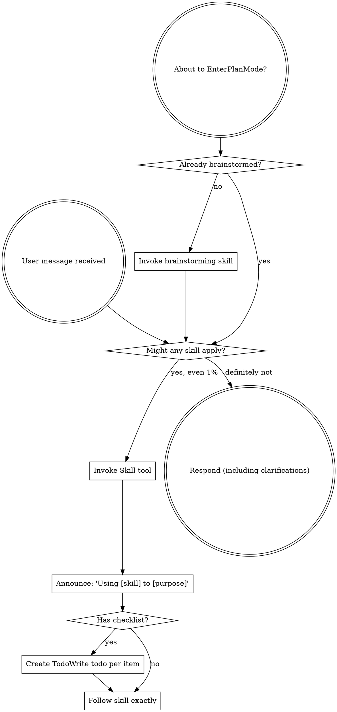
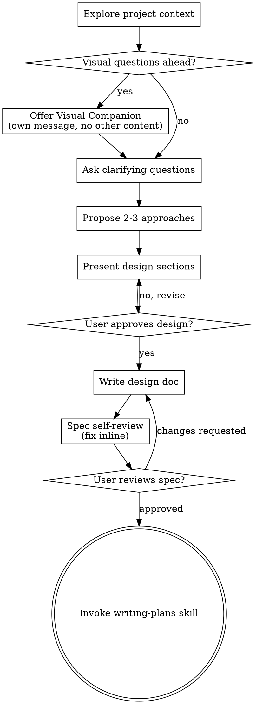

Reading additional input from stdin...
OpenAI Codex v0.142.0
--------
workdir: /Users/arrivarus/Documents/VibeCoding2/2026.06 fb2-to-epub
model: gpt-5.5
provider: openai
approval: never
sandbox: read-only
reasoning effort: xhigh
reasoning summaries: none
session id: 019ef58e-1679-7af0-80ee-026f6358fa7d
--------
user
Ты — старший macOS-инженер и архитектор дистрибутива. Спроектируй переход проекта с 'git clone + install.sh' на 'скачал .dmg → запустил .app → выбрал ЛЮБУЮ папку → автоконвертация фоном'. Верни ПЛАН (не реализацию).

СНАЧАЛА ПРОЧИТАЙ эти файлы (sandbox read-only это разрешает):
- install.sh
- uninstall.sh
- bin/fb2-to-epub-watcher.sh
- launchd/com.user.fb2-to-epub.plist.template
- /Users/arrivarus/Documents/VibeCoding2/2026.06 Юрка/projects/fb2-to-epub/research/packaging-2026.md
(если bin/fb2-to-epub-cover-finder.py есть — глянь сигнатуру вызова).

ТЕКУЩЕЕ СОСТОЯНИЕ: launchd LaunchAgent с WatchPaths → bin/fb2-to-epub-watcher.sh (+ python3 cover-finder, без зависимостей) → Calibre CLI (/Applications/calibre.app/Contents/MacOS/ebook-convert). install.sh копирует скрипты в ~/.local/bin, рендерит plist из шаблона (sed __HOME__), грузит агент через launchctl load -w. Папка сейчас захардкожена ~/Desktop/fb2-to-epub. Репо: github.com/ArrivaRUS/fb2-to-epub, public, ветка main.

ПРИНЯТЫЕ РЕШЕНИЯ (constraints — НЕ пересматривай, проектируй внутри них):
- D1: приложение = ОДНОРАЗОВЫЙ установщик (запустил → выбрал папку → настроил автоматизацию → закрыл; дальше работает фоном через launchd). НЕ резидент меню-бара.
- D2: БЕЗ платной подписи Apple (бесплатно). Принимаем 1 ручной шаг первого запуска (System Settings → Privacy & Security → Open Anyway на macOS 15+); задача — сделать его понятным, не убрать.
- D3: Calibre — внешняя зависимость; детект + подсказка установки (brew cask или calibre-ebook.com). НЕ встраивать.

СПРОЕКТИРУЙ И ОТВЕТЬ НА ВСЕ 8 ПУНКТОВ (ровно эта структура — её сверят с другим архитектором):

1. СТЕК .app без Xcode: AppleScript application vs Platypus — выбор+обоснование, воспроизводимая сборка (CLI, без GUI Xcode), размер бандла, поддержка/долговечность. Дай рекомендацию для v1.
2. ПОТОК УСТАНОВЩИКА по шагам: запуск .app → детект Calibre (что если нет) → выбор папки (диалог) → обработка TCC при выборе Desktop/Documents/Downloads → установка (куда кладём скрипты, как рендерим plist с ВЫБРАННЫМ WATCH_DIR) → (пере)загрузка агента → экран успеха → выход. Повторный запуск/идемпотентность (что если уже установлено / выбрана новая папка).
3. LAUNCHD: миграция load -w/unload → bootstrap gui/$UID / bootout / kickstart; plist под ПРОИЗВОЛЬНЫЙ WATCH_DIR; как агент в урезанном окружении найдёт Calibre и python3; как .app (пере)загружает агент.
4. TCC: стратегия, чтобы ФОНОВЫЙ watcher реально читал выбранную пользователем папку (Desktop/Documents/Downloads под защитой). Что делаем для дефолта v1 без подписи (Full Disk Access? папочный грант? выбор папки вне защищённых зон?). Дай конкретный дефолт.
5. DMG: чем собрать (create-dmg npm vs hdiutil), раскладка окна (.app + симлинк /Applications), фон-инструкция про Open Anyway, иконка тома, скрипт сборки в репо (где лежит, что делает).
6. СТРУКТУРА РЕПО: где исходник .app/обёртки (.applescript или Platypus-профиль), build-скрипты, как сосуществуют старый CLI install.sh и новый .app, какие изменения README, где лежит .icns.
7. РАСПРОСТРАНЕНИЕ: GitHub Release с .dmg (теги/версии/что приложить), что написать в README для пользователя.
8. РИСКИ и развилки, требующие решения человека; предложи этапность v1 (минимальный жизнеспособный сценарий → что отложить).

ФОРМАТ ВЫВОДА: пункты 1–8 (заголовок + по делу, можно списками/мини-таблицами), затем 'ИТОГ' (3–5 строк, суть подхода), затем 'УВЕРЕННОСТЬ' (по ключевым решениям, low/med/high и почему). Будь конкретным и инженерным: команды, пути, имена файлов. Не пиши код целиком — это план, но точные команды launchctl/codesign/xattr/hdiutil приводи.
codex
Использую навыки `superpowers:using-superpowers`, `superpowers:brainstorming`, `build-macos-apps:packaging-notarization` и `build-macos-apps:signing-entitlements`: запрос про архитектурный план macOS-дистрибутива, DMG/Gatekeeper и запуск без платной подписи. Сначала читаю инструкции навыков и указанные файлы проекта.
exec
/bin/zsh -lc "sed -n '1,260p' /Users/arrivarus/.codex/skills/.system/superpowers/brainstorming/SKILL.md" in /Users/arrivarus/Documents/VibeCoding2/2026.06 fb2-to-epub
exec
/bin/zsh -lc "sed -n '1,220p' /Users/arrivarus/.codex/skills/.system/superpowers/using-superpowers/SKILL.md" in /Users/arrivarus/Documents/VibeCoding2/2026.06 fb2-to-epub
exec
/bin/zsh -lc "sed -n '1,260p' /Users/arrivarus/.codex/plugins/cache/openai-curated/build-macos-apps/b4b39dbf/skills/packaging-notarization/SKILL.md" in /Users/arrivarus/Documents/VibeCoding2/2026.06 fb2-to-epub
 exited 1 in 0ms:
sed: /Users/arrivarus/.codex/skills/.system/superpowers/using-superpowers/SKILL.md: No such file or directory

 exited 1 in 0ms:
sed: /Users/arrivarus/.codex/skills/.system/superpowers/brainstorming/SKILL.md: No such file or directory

 succeeded in 0ms:
---
name: packaging-notarization
description: Prepare macOS packaging and notarization workflows. Use when archiving apps, validating bundles, or explaining distribution-only failures.
---

# Packaging & Notarization

## Quick Start

Use this skill when the work is about shipping the app rather than merely
running it locally: archives, exported app bundles, notarization readiness,
hardened runtime, or distribution validation.

## Workflow

1. Confirm the distribution goal.
   - Local archive validation
   - Signed distributable app
   - Notarization troubleshooting

2. Inspect the artifact.
   - Validate app bundle structure.
   - Check nested frameworks, helper tools, and entitlements.

3. Inspect signing and runtime prerequisites.
   - Hardened runtime
   - Signing identity
   - Nested code signatures
   - Required entitlements

4. Explain notarization readiness or failure.
   - Separate packaging issues from trust-policy symptoms.
   - Point to the minimum follow-up validation commands.

## Guardrails

- Do not present notarization as required for ordinary local debug runs.
- Call out when you lack the actual exported artifact and are inferring from project settings.
- Keep advice concrete and verifiable.

## Output Expectations

Provide:
- what artifact or settings were inspected
- whether the app looks distribution-ready
- the top missing prerequisite or failure mode
- the next validation or repair step

exec
/bin/zsh -lc "sed -n '1,260p' /Users/arrivarus/.codex/plugins/cache/openai-curated/build-macos-apps/b4b39dbf/skills/signing-entitlements/SKILL.md" in /Users/arrivarus/Documents/VibeCoding2/2026.06 fb2-to-epub
 succeeded in 0ms:
---
name: signing-entitlements
description: Inspect macOS signing, entitlements, and Gatekeeper issues. Use when diagnosing code signing, sandbox, hardened runtime, or trust failures.
---

# Signing & Entitlements

## Quick Start

Use this skill when the failure smells like codesigning rather than compilation:
launch refusal, missing entitlement, invalid signature, sandbox mismatch,
hardened runtime confusion, or trust-policy rejection.

## Workflow

1. Inspect the bundle or binary.
   - Locate the `.app` or executable.
   - Identify the main binary inside `Contents/MacOS/`.

2. Read signing details.
   - Use `codesign -dvvv --entitlements :- <path>`.
   - Use `spctl -a -vv <path>` when Gatekeeper behavior matters.
   - Use `plutil -p` for entitlements or Info.plist inspection.

3. Classify the failure.
   - Unsigned or ad hoc signed
   - Wrong identity
   - Entitlement mismatch
   - Hardened runtime issue
   - App Sandbox issue
   - Nested code signing issue
   - Distribution/notarization prerequisite issue

4. Explain the minimum fix path.
   - Say exactly what is wrong.
   - Show the shortest set of validation or repair commands.
   - Distinguish local development problems from distribution problems.

## Useful Commands

- `codesign -dvvv --entitlements :- <app-or-binary>`
- `spctl -a -vv <app-or-binary>`
- `security find-identity -p codesigning -v`
- `plutil -p <path-to-entitlements-or-plist>`

## Guardrails

- Never invent missing entitlements.
- Do not conflate notarization with local debug signing.
- If the real issue is a build setting or provisioning profile, say so directly.

## Output Expectations

Provide:
- what artifact was inspected
- what signing state it is in
- the exact failure class
- the minimum fix or validation sequence

codex
Два файла навыков лежат в plugin cache по алиасу `r6`, а не в системной папке; перечитываю их по фактическому пути и параллельно начинаю осмотр проекта.
exec
/bin/zsh -lc "sed -n '1,260p' /Users/arrivarus/.codex/plugins/cache/openai-curated/superpowers/b4b39dbf/skills/using-superpowers/SKILL.md" in /Users/arrivarus/Documents/VibeCoding2/2026.06 fb2-to-epub
 succeeded in 0ms:
---
name: using-superpowers
description: Use when starting any conversation - establishes how to find and use skills, requiring Skill tool invocation before ANY response including clarifying questions
---

<SUBAGENT-STOP>
If you were dispatched as a subagent to execute a specific task, skip this skill.
</SUBAGENT-STOP>

<EXTREMELY-IMPORTANT>
If you think there is even a 1% chance a skill might apply to what you are doing, you ABSOLUTELY MUST invoke the skill.

IF A SKILL APPLIES TO YOUR TASK, YOU DO NOT HAVE A CHOICE. YOU MUST USE IT.

This is not negotiable. This is not optional. You cannot rationalize your way out of this.
</EXTREMELY-IMPORTANT>

## Instruction Priority

Superpowers skills override default system prompt behavior, but **user instructions always take precedence**:

1. **User's explicit instructions** (CLAUDE.md, GEMINI.md, AGENTS.md, direct requests) — highest priority
2. **Superpowers skills** — override default system behavior where they conflict
3. **Default system prompt** — lowest priority

If CLAUDE.md, GEMINI.md, or AGENTS.md says "don't use TDD" and a skill says "always use TDD," follow the user's instructions. The user is in control.

## How to Access Skills

**In Claude Code:** Use the `Skill` tool. When you invoke a skill, its content is loaded and presented to you—follow it directly. Never use the Read tool on skill files.

**In Copilot CLI:** Use the `skill` tool. Skills are auto-discovered from installed plugins. The `skill` tool works the same as Claude Code's `Skill` tool.

**In Gemini CLI:** Skills activate via the `activate_skill` tool. Gemini loads skill metadata at session start and activates the full content on demand.

**In other environments:** Check your platform's documentation for how skills are loaded.

## Platform Adaptation

Skills use Claude Code tool names. Non-CC platforms: see `references/copilot-tools.md` (Copilot CLI), `references/codex-tools.md` (Codex) for tool equivalents. Gemini CLI users get the tool mapping loaded automatically via GEMINI.md.

# Using Skills

## The Rule

**Invoke relevant or requested skills BEFORE any response or action.** Even a 1% chance a skill might apply means that you should invoke the skill to check. If an invoked skill turns out to be wrong for the situation, you don't need to use it.



## Red Flags

These thoughts mean STOP—you're rationalizing:

| Thought | Reality |
|---------|---------|
| "This is just a simple question" | Questions are tasks. Check for skills. |
| "I need more context first" | Skill check comes BEFORE clarifying questions. |
| "Let me explore the codebase first" | Skills tell you HOW to explore. Check first. |
| "I can check git/files quickly" | Files lack conversation context. Check for skills. |
| "Let me gather information first" | Skills tell you HOW to gather information. |
| "This doesn't need a formal skill" | If a skill exists, use it. |
| "I remember this skill" | Skills evolve. Read current version. |
| "This doesn't count as a task" | Action = task. Check for skills. |
| "The skill is overkill" | Simple things become complex. Use it. |
| "I'll just do this one thing first" | Check BEFORE doing anything. |
| "This feels productive" | Undisciplined action wastes time. Skills prevent this. |
| "I know what that means" | Knowing the concept ≠ using the skill. Invoke it. |

## Skill Priority

When multiple skills could apply, use this order:

1. **Process skills first** (brainstorming, debugging) - these determine HOW to approach the task
2. **Implementation skills second** (frontend-design, mcp-builder) - these guide execution

"Let's build X" → brainstorming first, then implementation skills.
"Fix this bug" → debugging first, then domain-specific skills.

## Skill Types

**Rigid** (TDD, debugging): Follow exactly. Don't adapt away discipline.

**Flexible** (patterns): Adapt principles to context.

The skill itself tells you which.

## User Instructions

Instructions say WHAT, not HOW. "Add X" or "Fix Y" doesn't mean skip workflows.

exec
/bin/zsh -lc "sed -n '1,300p' /Users/arrivarus/.codex/plugins/cache/openai-curated/superpowers/b4b39dbf/skills/brainstorming/SKILL.md" in /Users/arrivarus/Documents/VibeCoding2/2026.06 fb2-to-epub
 succeeded in 0ms:
---
name: brainstorming
description: "You MUST use this before any creative work - creating features, building components, adding functionality, or modifying behavior. Explores user intent, requirements and design before implementation."
---

# Brainstorming Ideas Into Designs

Help turn ideas into fully formed designs and specs through natural collaborative dialogue.

Start by understanding the current project context, then ask questions one at a time to refine the idea. Once you understand what you're building, present the design and get user approval.

<HARD-GATE>
Do NOT invoke any implementation skill, write any code, scaffold any project, or take any implementation action until you have presented a design and the user has approved it. This applies to EVERY project regardless of perceived simplicity.
</HARD-GATE>

## Anti-Pattern: "This Is Too Simple To Need A Design"

Every project goes through this process. A todo list, a single-function utility, a config change — all of them. "Simple" projects are where unexamined assumptions cause the most wasted work. The design can be short (a few sentences for truly simple projects), but you MUST present it and get approval.

## Checklist

You MUST create a task for each of these items and complete them in order:

1. **Explore project context** — check files, docs, recent commits
2. **Offer visual companion** (if topic will involve visual questions) — this is its own message, not combined with a clarifying question. See the Visual Companion section below.
3. **Ask clarifying questions** — one at a time, understand purpose/constraints/success criteria
4. **Propose 2-3 approaches** — with trade-offs and your recommendation
5. **Present design** — in sections scaled to their complexity, get user approval after each section
6. **Write design doc** — save to `docs/superpowers/specs/YYYY-MM-DD-<topic>-design.md` and commit
7. **Spec self-review** — quick inline check for placeholders, contradictions, ambiguity, scope (see below)
8. **User reviews written spec** — ask user to review the spec file before proceeding
9. **Transition to implementation** — invoke writing-plans skill to create implementation plan

## Process Flow



**The terminal state is invoking writing-plans.** Do NOT invoke frontend-design, mcp-builder, or any other implementation skill. The ONLY skill you invoke after brainstorming is writing-plans.

## The Process

**Understanding the idea:**

- Check out the current project state first (files, docs, recent commits)
- Before asking detailed questions, assess scope: if the request describes multiple independent subsystems (e.g., "build a platform with chat, file storage, billing, and analytics"), flag this immediately. Don't spend questions refining details of a project that needs to be decomposed first.
- If the project is too large for a single spec, help the user decompose into sub-projects: what are the independent pieces, how do they relate, what order should they be built? Then brainstorm the first sub-project through the normal design flow. Each sub-project gets its own spec → plan → implementation cycle.
- For appropriately-scoped projects, ask questions one at a time to refine the idea
- Prefer multiple choice questions when possible, but open-ended is fine too
- Only one question per message - if a topic needs more exploration, break it into multiple questions
- Focus on understanding: purpose, constraints, success criteria

**Exploring approaches:**

- Propose 2-3 different approaches with trade-offs
- Present options conversationally with your recommendation and reasoning
- Lead with your recommended option and explain why

**Presenting the design:**

- Once you believe you understand what you're building, present the design
- Scale each section to its complexity: a few sentences if straightforward, up to 200-300 words if nuanced
- Ask after each section whether it looks right so far
- Cover: architecture, components, data flow, error handling, testing
- Be ready to go back and clarify if something doesn't make sense

**Design for isolation and clarity:**

- Break the system into smaller units that each have one clear purpose, communicate through well-defined interfaces, and can be understood and tested independently
- For each unit, you should be able to answer: what does it do, how do you use it, and what does it depend on?
- Can someone understand what a unit does without reading its internals? Can you change the internals without breaking consumers? If not, the boundaries need work.
- Smaller, well-bounded units are also easier for you to work with - you reason better about code you can hold in context at once, and your edits are more reliable when files are focused. When a file grows large, that's often a signal that it's doing too much.

**Working in existing codebases:**

- Explore the current structure before proposing changes. Follow existing patterns.
- Where existing code has problems that affect the work (e.g., a file that's grown too large, unclear boundaries, tangled responsibilities), include targeted improvements as part of the design - the way a good developer improves code they're working in.
- Don't propose unrelated refactoring. Stay focused on what serves the current goal.

## After the Design

**Documentation:**

- Write the validated design (spec) to `docs/superpowers/specs/YYYY-MM-DD-<topic>-design.md`
  - (User preferences for spec location override this default)
- Use elements-of-style:writing-clearly-and-concisely skill if available
- Commit the design document to git

**Spec Self-Review:**
After writing the spec document, look at it with fresh eyes:

1. **Placeholder scan:** Any "TBD", "TODO", incomplete sections, or vague requirements? Fix them.
2. **Internal consistency:** Do any sections contradict each other? Does the architecture match the feature descriptions?
3. **Scope check:** Is this focused enough for a single implementation plan, or does it need decomposition?
4. **Ambiguity check:** Could any requirement be interpreted two different ways? If so, pick one and make it explicit.

Fix any issues inline. No need to re-review — just fix and move on.

**User Review Gate:**
After the spec review loop passes, ask the user to review the written spec before proceeding:

> "Spec written and committed to `<path>`. Please review it and let me know if you want to make any changes before we start writing out the implementation plan."

Wait for the user's response. If they request changes, make them and re-run the spec review loop. Only proceed once the user approves.

**Implementation:**

- Invoke the writing-plans skill to create a detailed implementation plan
- Do NOT invoke any other skill. writing-plans is the next step.

## Key Principles

- **One question at a time** - Don't overwhelm with multiple questions
- **Multiple choice preferred** - Easier to answer than open-ended when possible
- **YAGNI ruthlessly** - Remove unnecessary features from all designs
- **Explore alternatives** - Always propose 2-3 approaches before settling
- **Incremental validation** - Present design, get approval before moving on
- **Be flexible** - Go back and clarify when something doesn't make sense

## Visual Companion

A browser-based companion for showing mockups, diagrams, and visual options during brainstorming. Available as a tool — not a mode. Accepting the companion means it's available for questions that benefit from visual treatment; it does NOT mean every question goes through the browser.

**Offering the companion:** When you anticipate that upcoming questions will involve visual content (mockups, layouts, diagrams), offer it once for consent:
> "Some of what we're working on might be easier to explain if I can show it to you in a web browser. I can put together mockups, diagrams, comparisons, and other visuals as we go. This feature is still new and can be token-intensive. Want to try it? (Requires opening a local URL)"

**This offer MUST be its own message.** Do not combine it with clarifying questions, context summaries, or any other content. The message should contain ONLY the offer above and nothing else. Wait for the user's response before continuing. If they decline, proceed with text-only brainstorming.

**Per-question decision:** Even after the user accepts, decide FOR EACH QUESTION whether to use the browser or the terminal. The test: **would the user understand this better by seeing it than reading it?**

- **Use the browser** for content that IS visual — mockups, wireframes, layout comparisons, architecture diagrams, side-by-side visual designs
- **Use the terminal** for content that is text — requirements questions, conceptual choices, tradeoff lists, A/B/C/D text options, scope decisions

A question about a UI topic is not automatically a visual question. "What does personality mean in this context?" is a conceptual question — use the terminal. "Which wizard layout works better?" is a visual question — use the browser.

If they agree to the companion, read the detailed guide before proceeding:
`skills/brainstorming/visual-companion.md`

exec
/bin/zsh -lc "sed -n '1,240p' install.sh" in /Users/arrivarus/Documents/VibeCoding2/2026.06 fb2-to-epub
 succeeded in 0ms:
#!/bin/bash
set -euo pipefail

REPO_DIR="$(cd "$(dirname "${BASH_SOURCE[0]}")" && pwd)"
LABEL="com.user.fb2-to-epub"
SCRIPT_DST="$HOME/.local/bin/fb2-to-epub-watcher.sh"
COVER_DST="$HOME/.local/bin/fb2-to-epub-cover-finder.py"
PLIST_DST="$HOME/Library/LaunchAgents/$LABEL.plist"
WATCH_DIR="$HOME/Desktop/fb2-to-epub"
EBOOK_CONVERT="/Applications/calibre.app/Contents/MacOS/ebook-convert"

if [[ ! -x "$EBOOK_CONVERT" ]]; then
  echo "Calibre not found at $EBOOK_CONVERT" >&2
  echo "Install it first: brew install --cask calibre  (or download from https://calibre-ebook.com)" >&2
  exit 1
fi

if ! command -v python3 >/dev/null 2>&1; then
  echo "python3 not found; install Xcode Command Line Tools: xcode-select --install" >&2
  exit 1
fi

mkdir -p "$(dirname "$SCRIPT_DST")" "$(dirname "$PLIST_DST")" "$WATCH_DIR" "$HOME/Library/Logs"

install -m 0755 "$REPO_DIR/bin/fb2-to-epub-watcher.sh" "$SCRIPT_DST"
install -m 0755 "$REPO_DIR/bin/fb2-to-epub-cover-finder.py" "$COVER_DST"
sed "s|__HOME__|$HOME|g" "$REPO_DIR/launchd/$LABEL.plist.template" > "$PLIST_DST"

launchctl unload "$PLIST_DST" 2>/dev/null || true
launchctl load -w "$PLIST_DST"

cat <<EOF
Installed.
  Watch folder: $WATCH_DIR
  Script:       $SCRIPT_DST
  Cover finder: $COVER_DST
  LaunchAgent:  $PLIST_DST
  Log:          $HOME/Library/Logs/fb2-to-epub.log

Drop .fb2 / .fb2.zip files or folders into the watch folder.
EOF

exec
/bin/zsh -lc "sed -n '1,280p' bin/fb2-to-epub-watcher.sh" in /Users/arrivarus/Documents/VibeCoding2/2026.06 fb2-to-epub
 succeeded in 0ms:
#!/bin/bash
# Watches ~/Desktop/fb2-to-epub. For each top-level entry:
#   - .fb2 / .fb2.zip file  -> sibling .epub
#   - folder                -> sibling "<name>-epub" with mirrored tree of .epub files
#
# Cover handling:
#   - If FB2 has an embedded cover, Calibre keeps it as-is.
#   - Otherwise the cover-finder script searches Google Books for a match.
#   - If nothing is found (or no network), the EPUB is produced without a cover
#     (Calibre's default placeholder is suppressed via --no-default-epub-cover).
#
# Idempotent: skips outputs that are newer than their source.

set -u
set -o pipefail

WATCH_DIR="$HOME/Desktop/fb2-to-epub"
LOG_FILE="$HOME/Library/Logs/fb2-to-epub.log"
LOCK_DIR="/tmp/fb2-to-epub.lock.d"
EBOOK_CONVERT="/Applications/calibre.app/Contents/MacOS/ebook-convert"
COVER_FINDER="$HOME/.local/bin/fb2-to-epub-cover-finder.py"

mkdir -p "$WATCH_DIR" "$(dirname "$LOG_FILE")"

log() { printf '[%s] %s\n' "$(date '+%F %T')" "$*" >> "$LOG_FILE"; }

if ! mkdir "$LOCK_DIR" 2>/dev/null; then
  log "another run in progress; exiting"
  exit 0
fi
trap 'rmdir "$LOCK_DIR" 2>/dev/null || true' EXIT

if [[ ! -x "$EBOOK_CONVERT" ]]; then
  log "ebook-convert not found at $EBOOK_CONVERT"
  exit 1
fi

log "=== run start ==="

epub_name() {
  local name="$1" lower
  lower="$(printf '%s' "$name" | tr '[:upper:]' '[:lower:]')"
  case "$lower" in
    *.fb2.zip) printf '%s' "${name%.[fF][bB]2.[zZ][iI][pP]}.epub" ;;
    *.fb2)     printf '%s' "${name%.[fF][bB]2}.epub" ;;
    *)         printf '' ;;
  esac
}

convert_book() {
  local src="$1" dst="$2"
  if [[ -e "$dst" ]] && [[ "$dst" -nt "$src" ]]; then
    log "skip (up-to-date): ${dst#$WATCH_DIR/}"
    return 0
  fi
  mkdir -p "$(dirname "$dst")"

  local cover_args=("--no-default-epub-cover")
  local cover_tmp_dir cover_tmp rc
  cover_tmp_dir="$(mktemp -d -t fb2cover)"
  cover_tmp="$cover_tmp_dir/cover.jpg"

  if [[ -x "$COVER_FINDER" ]]; then
    rc=0
    /usr/bin/env python3 "$COVER_FINDER" "$src" "$cover_tmp" >/dev/null 2>>"$LOG_FILE" || rc=$?
    case $rc in
      0) cover_args=(--cover "$cover_tmp" --no-default-epub-cover)
         log "cover (online): ${src#$WATCH_DIR/}" ;;
      3) log "cover (embedded): ${src#$WATCH_DIR/}" ;;
      *) log "cover (none):    ${src#$WATCH_DIR/}" ;;
    esac
  fi

  log "convert: ${src#$WATCH_DIR/}"
  if "$EBOOK_CONVERT" "$src" "$dst" "${cover_args[@]}" >>"$LOG_FILE" 2>&1; then
    log "ok:      ${dst#$WATCH_DIR/}"
  else
    log "FAIL:    ${src#$WATCH_DIR/}"
    rm -f "$dst" 2>/dev/null || true
  fi

  rm -rf "$cover_tmp_dir"
}

process_folder_tree() {
  local src_root="$1" mirror_root="$2"
  mkdir -p "$mirror_root"
  find "$src_root" -type f \( -iname '*.fb2' -o -iname '*.fb2.zip' \) -print0 \
    | while IFS= read -r -d '' f; do
        local rel base out_name out_path dir_part
        rel="${f#$src_root/}"
        base="${rel##*/}"
        out_name="$(epub_name "$base")"
        [[ -z "$out_name" ]] && continue
        if [[ "$rel" == */* ]]; then
          dir_part="${rel%/*}"
          out_path="$mirror_root/$dir_part/$out_name"
        else
          out_path="$mirror_root/$out_name"
        fi
        convert_book "$f" "$out_path"
      done
}

shopt -s nullglob dotglob
for entry in "$WATCH_DIR"/*; do
  name="${entry##*/}"
  case "$name" in
    .DS_Store|.localized) continue ;;
  esac
  if [[ -f "$entry" ]]; then
    out_name="$(epub_name "$name")"
    [[ -z "$out_name" ]] && continue
    convert_book "$entry" "$WATCH_DIR/$out_name"
  elif [[ -d "$entry" ]]; then
    case "$name" in
      *-epub) continue ;;
    esac
    process_folder_tree "$entry" "$WATCH_DIR/${name}-epub"
  fi
done

log "=== run end ==="

exec
/bin/zsh -lc "sed -n '1,240p' uninstall.sh" in /Users/arrivarus/Documents/VibeCoding2/2026.06 fb2-to-epub
 succeeded in 0ms:
#!/bin/bash
set -u

LABEL="com.user.fb2-to-epub"
PLIST="$HOME/Library/LaunchAgents/$LABEL.plist"
SCRIPT="$HOME/.local/bin/fb2-to-epub-watcher.sh"
COVER="$HOME/.local/bin/fb2-to-epub-cover-finder.py"
WATCH_DIR="$HOME/Desktop/fb2-to-epub"

launchctl unload "$PLIST" 2>/dev/null || true
rm -f "$PLIST" "$SCRIPT" "$COVER"

echo "Uninstalled LaunchAgent and watcher script."
echo "Watch folder kept at: $WATCH_DIR (delete manually if you want)."

exec
/bin/zsh -lc "sed -n '1,220p' launchd/com.user.fb2-to-epub.plist.template" in /Users/arrivarus/Documents/VibeCoding2/2026.06 fb2-to-epub
 succeeded in 0ms:
<?xml version="1.0" encoding="UTF-8"?>
<!DOCTYPE plist PUBLIC "-//Apple//DTD PLIST 1.0//EN" "http://www.apple.com/DTDs/PropertyList-1.0.dtd">
<plist version="1.0">
<dict>
    <key>Label</key>
    <string>com.user.fb2-to-epub</string>
    <key>ProgramArguments</key>
    <array>
        <string>/bin/bash</string>
        <string>__HOME__/.local/bin/fb2-to-epub-watcher.sh</string>
    </array>
    <key>WatchPaths</key>
    <array>
        <string>__HOME__/Desktop/fb2-to-epub</string>
    </array>
    <key>RunAtLoad</key>
    <true/>
    <key>ThrottleInterval</key>
    <integer>5</integer>
    <key>StandardOutPath</key>
    <string>__HOME__/Library/Logs/fb2-to-epub.stdout.log</string>
    <key>StandardErrorPath</key>
    <string>__HOME__/Library/Logs/fb2-to-epub.stderr.log</string>
</dict>
</plist>

Работа только на чтение: сначала фиксирую фактическое состояние проекта, затем даю план перехода на .dmg/.app.
  → Прочитать обязательные файлы и исследование packaging-2026
  • Проверить структуру репо и сигнатуру cover-finder
  • Сформировать архитектурный план по 8 пунктам
codex
Фактическая текущая схема подтверждается файлами: watcher сам захардкоживает `~/Desktop/fb2-to-epub`, plist тоже подставляет только `__HOME__`, а Calibre ищется по абсолютному пути в `/Applications/calibre.app`. Теперь читаю исследование по упаковке и смежные файлы, чтобы план не расходился с уже собранными выводами.
exec
/bin/zsh -lc "sed -n '301,620p' /Users/arrivarus/.codex/plugins/cache/openai-curated/superpowers/b4b39dbf/skills/brainstorming/SKILL.md" in /Users/arrivarus/Documents/VibeCoding2/2026.06 fb2-to-epub
 succeeded in 0ms:
exec
/bin/zsh -lc "sed -n '1,260p' '/Users/arrivarus/Documents/VibeCoding2/2026.06 Юрка/projects/fb2-to-epub/research/packaging-2026.md'" in /Users/arrivarus/Documents/VibeCoding2/2026.06 fb2-to-epub
 succeeded in 0ms:
# Ресёрч: упаковка и дистрибуция fb2-to-epub (macOS), 2026

> Researcher → Юрке. Фаза планирования: выбрать стек для перехода
> `git clone + install.sh` → «скачал .dmg → запустил .app → выбрал ЛЮБУЮ папку → автоконвертация».
> Дата: 2026-06-23. Бэкенд поиска: Яндекс Search API (SEARCH_TYPE_COM) + WebFetch первоисточников.
> Каждый факт — источник + уверенность (high/med/low).

---

## Итог (2–4 строки)

Для v1 минимальный риск/усилие даёт **AppleScript-приложение** (`choose folder` + `do shell script`,
экспорт из Script Editor в `.app`) или **Platypus** как обёртка существующего shell-скрипта — оба
**не требуют Xcode/Swift** и переиспользуют готовый watcher. DMG собирать через **`create-dmg`
(npm, sindresorhus)** или чистый `hdiutil`. Главный барьер дистрибуции — **не сборка, а Gatekeeper
в macOS 15+**: без платной подписи Apple ($99/год) + нотаризации пользователь упрётся в блокировку и
ручной обход через **System Settings → Privacy & Security → Open Anyway** (ПКМ→Открыть в Sequoia
больше не работает). Calibre оставить **внешней зависимостью** с паттерном «детект → подсказать
`brew install --cask calibre`»; встраивать движок не стоит (размер + GPL).

---

## Тема 1. Минимальное macOS-приложение (выбор папки + установка launchd-агента)

Сравнение 4 подходов. Все должны: (а) показать диалог выбора папки, (б) записать per-user LaunchAgent
с `WatchPaths` на выбранный путь и (пере)загрузить его.

| Подход | Нужен Xcode? | Размер | Сложность сборки (вкл. CI без GUI) | UX | Как ставит launchd | Риски / поддержка |
|---|---|---|---|---|---|---|
| **AppleScript .app** (`choose folder` + `do shell script`, экспорт из Script Editor → File→Export→Application) | **Нет** | КБ | Очень низкая; экспорт скриптуем через `osacompile` (CLI, без GUI) | Нативный системный диалог выбора папки; запуск двойным кликом | Скрипт зовёт shell, который пишет plist и делает `launchctl bootstrap` | Встроено в macOS, но «олдскул»; нет современного UI; авторизация прав — через сам диалог |
| **Platypus** (обёртка shell/python → .app, бинарь-лаунчер) | **Нет** (бинарь `platypus_clt` ставится в `/usr/local/bin` без сборки из исходников) | Слим app-бинарь + твой скрипт (КБ–сотни КБ) | Низкая; `platypus_clt` поддерживает все флаги GUI, интегрируется в CI/CD | Можно «прогресс-бар»/текстовый вывод; кнопки. Диалог папки — через сам скрипт (`osascript choose folder`) | Скрипт делает всю работу: plist + `launchctl` | Зрелый (v5.5.0, релиз 2025-12-02), Universal Intel/ARM, требует macOS 11+; зависимость от стороннего тула; ad-hoc подпись лаунчера |
| **Нативный SwiftUI .app** (`NSOpenPanel`/`fileImporter`) | **Да** (Xcode + Swift) | Несколько МБ | Высокая; CI нужен macOS-раннер с Xcode (GitHub Actions `macos-latest` умеет, но дольше/сложнее) | Лучший, «настоящее приложение»; нативный `fileImporter` | Из Swift пишем plist и зовём `launchctl` через `Process` | Будущее-устойчиво, но overkill для утилиты; самый дорогой путь |
| **Menu-bar resident** (SwiftUI `MenuBarExtra`, `LSUIElement=true`, без Dock-иконки) | **Да** (Xcode + Swift) | Несколько МБ | Высокая (как SwiftUI) | Резидент в меню-баре: статус, пауза, смена папки — удобно для «фонового конвертера» | Тот же `launchctl` из Swift; либо сам резидент следит за папкой (FSEvents) вместо launchd | Лучший UX для долгоживущего фонового тула, но самый дорогой; стоит для v2 |

Находки/риски (Тема 1):
- **AppleScript умеет и выбор папки, и shell**: `set theFolder to (choose folder)` + `do shell script`,
  экспорт в `.app` через File→Export (формат Application). Источник:
  https://discussions.apple.com/thread/6890578 ,
  https://developer.apple.com/library/archive/documentation/LanguagesUtilities/Conceptual/MacAutomationScriptingGuide/CallCommandLineUtilities.html — **уверенность high**.
- Экспорт AppleScript в .app скриптуем (CLI `osacompile -o App.app script.applescript`), т.е. **CI без GUI возможен**.
  Источник: https://apple.stackexchange.com/questions/206416/applescript-to-export-script-editor-script-as-application — **med** (статья про GUI-экспорт; `osacompile` — общеизвестный CLI, но конкретного гайда в выдаче нет).
- **Platypus**: «creates native Mac applications from command line scripts (shell, Python, …), wrapping
  the script in an application bundle along with a slim app binary». CLI `platypus_clt` повторяет все
  возможности GUI и **интегрируется в CI/CD**. Бинарь можно поставить **без сборки из исходников**
  (Xcode нужен только чтобы собрать сам Platypus, не приложения). Universal Intel/ARM, требует **macOS 11+**.
  Последняя версия **5.5.0 (2025-12-02)** — живой проект.
  Источники: https://github.com/sveinbjornt/Platypus , https://sveinbjorn.org/platypus ,
  https://github.com/sveinbjornt/Platypus/releases , https://deepwiki.com/sveinbjornt/Platypus — **уверенность high**.
- **SwiftUI `MenuBarExtra`** — штатный способ menu-bar утилит; скрытие Dock-иконки делается отдельно
  через `LSUIElement` (он же «Application is agent») в Info.plist. Источники:
  https://developer.apple.com/documentation/swiftui/menubarextra ,
  https://nilcoalescing.com/blog/BuildAMacOSMenuBarUtilityInSwiftUI/ ,
  https://yourstash.ai/articles/macos-menu-bar-app-swift (раздел «Decision 3: LSUIElement and the Dock») — **уверенность high**.
- Любой shell/AppleScript-подход можно «сделать .app» вручную (положить скрипт в
  `App.app/Contents/MacOS/`), но это хрупко без Info.plist/иконки — Platypus/AppleScript это делают правильно.
  Источник: https://apple.stackexchange.com/questions/224394/ — **med**.

---

## Тема 2. Сборка DMG (2026)

| Инструмент | Что даёт | Команда | Подпись/нотаризация | Зависимости |
|---|---|---|---|---|
| **`create-dmg` (npm, sindresorhus)** | «Good-looking DMG за секунды»: авто-layout, фон, символьная ссылка на /Applications, позиционирование иконок | `create-dmg <app> [destination]` | Пытается подписать DMG (не критично если упадёт); флаг `--no-code-sign` для CI; флаг `--identity=`. **Нотаризацию делаешь отдельно** | Node.js ≥ 20; результат работает на macOS ≥ 10.13 |
| **`create-dmg` (shell, andreyvit / create-dmg)** | «Shell script to build fancy DMGs»: фон-картинка, позиции иконок, размер окна, симлинк на Applications | `create-dmg --volname ... --background ... --icon ... app.dmg source/` | Не подписывает сам; подпись/нотаризация — отдельно | Чистый bash + системные утилиты |
| **Чистый `hdiutil`** | Полный контроль, без зависимостей; нужно вручную: смонтировать rw, разложить, выставить фон/иконку через AppleScript к Finder, `hdiutil convert` в сжатый ro | `hdiutil create ...` / `hdiutil convert ...` | Ничего не делает за тебя | Только система |

Находки/риски (Тема 2):
- `create-dmg` (npm): «Create a good-looking DMG for your macOS app in seconds»; install
  `npm install --global create-dmg`; usage `create-dmg <app> [destination]`; опции `--overwrite`,
  `--no-version-in-filename`, `--identity=`, `--dmg-title=`, **`--no-code-sign`** (удобно в CI);
  требует **Node.js ≥ 20**; «**Don't forget to notarize your DMG**» (нотаризация — отдельный шаг).
  Источник: https://github.com/sindresorhus/create-dmg — **уверенность high**.
- Типовое оформление DMG (фон-картинка, иконка тома, симлинк на `/Applications`, позиционирование) —
  устоявшийся паттерн; обзор современных подходов: https://zgcoder.net/ramblings/modern-dmgs/ ,
  классический Q&A по «nice-looking DMG из CLI»: https://stackoverflow.com/questions/96882/ — **уверенность high**.
- Shell-`create-dmg` (andreyvit) — «A shell script to build fancy DMGs», без Node-зависимости.
  Источник: https://git-stars.org/blog/summaries/create-dmg/create-dmg — **med** (репо известное; вторичный источник).
- Риск пользователя: «образ диска повреждён» при открытии .dmg часто = тот же Gatekeeper/quarantine,
  а не битый файл. Источник: https://mac-soft.ru/blog/obraz-diska-povrezhden-dmg-ne-otkryvaetsya — **med**.

**Best practice:** для CI собирать `create-dmg ... --no-code-sign`, затем (если есть Developer ID)
подписать и нотаризовать готовый DMG отдельным шагом, потом `stapler staple` по DMG.

---

## Тема 3. Дистрибуция БЕЗ платного Apple Developer ID — что увидит пользователь (macOS 15+)

Это **главный барьер** и он ужесточился. Точные факты:

- **macOS 15 Sequoia убрал обход ПКМ→Открыть.** Дословно (Apple, цит. по iDownloadBlog):
  «In macOS Sequoia, users will no longer be able to **Control-click to override Gatekeeper** when
  opening software that isn't signed correctly or notarized.» Теперь путь один:
  **System Settings → Privacy & Security → (внизу) Open Anyway → Open**. Делается **только при первом
  запуске**, дальше приложение открывается без алертов.
  Источник: https://www.idownloadblog.com/2024/08/07/apple-macos-sequoia-gatekeeper-change-install-unsigned-apps-mac/ — **уверенность high**.
- **macOS 15.1 ещё жёстче / «Apple Forces Signing».** «Starting with macOS Sequoia 15, the easy
  bypassing of this feature … is now no longer an option», 15.1 закрывает обходы сильнее.
  ВНИМАНИЕ-противоречие (см. ниже): часть комментаторов считает, что в 15.1 секция Open Anyway
  «не появляется как задумано» — возможно баг.
  Источник: https://hackaday.com/2024/11/01/apple-forces-the-signing-of-applications-in-macos-sequoia-15-1/ — **med**.
- **Типичные формулировки Gatekeeper, которые увидит юзер** (по обзору ошибок):
  - «**"[App Name]" was blocked to protect your Mac**» — Gatekeeper заблокировал; нужен обход через System Settings.
  - «**"[App]" can't be opened because Apple cannot check it for malicious software**» (вариант для unidentified developer).
  - «**"[App]" is damaged and can't be opened. You should move it to the Trash**» — частый кейс для
    **скачанного неподписанного/ad-hoc** .app с выставленным `com.apple.quarantine`.
  Источники: https://cloudhousetechnologies.com/blog/mac-app-cannot-be-opened-gatekeeper-fix ,
  https://www.itech4mac.net/2021/01/fix-the-application-is-damaged-and-cant-be-opened/ — **уверенность med-high**.
- **Атрибут `com.apple.quarantine`** вешается на всё скачанное из интернета; Gatekeeper при первом
  запуске проверяет подпись/нотаризацию. Источник:
  https://gist.github.com/rsms/929c9c2fec231f0cf843a1a746a416f5 — **уверенность high**.

### Честные способы снизить трение БЕЗ подписи
- **Инструкция «Open Anyway»**: первый запуск → System Settings → Privacy & Security → Open Anyway → Open
  (на 15+ это основной путь, ПКМ→Открыть мёртв). **high**.
- **`xattr -dr com.apple.quarantine /Applications/App.app`** — снимает карантин, продолжает работать в
  Sequoia. Подходит для технически грамотных; в README + можно зашить в установочный шаг.
  Источники: https://github.com/mariopepe/KindleAdRemover/issues/12 ,
  https://gist.github.com/rsms/929c9c2fec231f0cf843a1a746a416f5 — **high**.
- **Ad-hoc подпись `codesign --force --deep --sign - App.app`** — снимает «is damaged» **на машине сборки**,
  НО важное ограничение ниже. **high (с оговоркой)**.
  - ⚠️ **Ключевой нюанс:** «Ad-hoc signed code only works (without user intervention) on the local
    machine that built it. If you copy an ad-hoc signed executable to another computer, macOS will kill
    it … an ad-hoc signed executable needs to be interactively opened via Finder once.» То есть ad-hoc
    **не убирает барьер при дистрибуции через DMG** — у конечного юзера всё равно будет ручной обход.
    Источник: https://gist.github.com/rsms/929c9c2fec231f0cf843a1a746a416f5 (+ подтверждение в выдаче) — **уверенность high**.

### Что даёт платная подпись + нотаризация
- **Стоимость: Apple Developer Program — $99/год.** «No way around it.» Подтверждено несколькими
  источниками. Источники: https://byby.dev/distributing-macos-apps ,
  https://www.iridium-works.com/en/blog-post/making-macos-app-bundles-signing-notarizing — **уверенность high**.
- **Шаги** (CLI, актуальные на 2025): нужен **Developer ID Application** сертификат + **hardened runtime**;
  `xcrun notarytool store-credentials …` → `xcrun notarytool submit <app|dmg> --keychain-profile … --wait`
  → `xcrun stapler staple <app|dmg>` → проверка `spctl --assess -vv …`. **`notarytool` заменил `altool`**.
  Источник: https://scriptingosx.com/2021/07/notarize-a-command-line-tool-with-notarytool/ — **уверенность high**.
- **Эффект на UX:** подписанное Developer ID + нотаризованное + застапленное приложение/DMG открывается
  у пользователя **двойным кликом без алертов и без обходов** — это единственный путь к «беспроблемному»
  опыту на 15+. Источник: https://developer.apple.com/videos/play/wwdc2019/703/ (stapling → «ready for
  distribution just like before») + общий консенсус источников — **уверенность high**.

**Вывод по Теме 3:** на macOS 15+ без $99 подписи у любого пользователя будет минимум один ручной шаг
(Open Anyway или `xattr`). Ad-hoc подпись косметику «is damaged» НЕ решает при переносе на чужую машину.

---

## Тема 4. launchd WatchPaths на ПРОИЗВОЛЬНОМ пути — подводные камни

- **TCC / права на папки.** Desktop, Documents, Downloads защищены TCC: фоновый/терминальный процесс
  без разрешения получает отказ/зависание чтения. «macOS may also gate Desktop, Documents, and Downloads
  for terminal/background processes. If file reads or directory listings hang, grant access to the same
  process context.» Если пользователь выберет такую папку — агент может не прочитать содержимое, пока не
  выдано разрешение (Full Disk Access или папочный TCC-грант для агента).
  Источники: https://openclaws.io/docs/platforms/mac/permissions/ ,
  https://docs.openclaw.ai/platforms/mac/permissions , https://afine.com/threat-of-tcc-bypasses-on-macos ,
  https://stackoverflow.com/questions/69609875/ (Desktop → `can't open input file`) — **уверенность med-high**.
- **TCC-грант привязан к подписи + bundle id + пути.** «TCC associates a permission grant with the app's
  code signature, bundle identifier, and on-disk path. If any of those change, macOS treats the app as new
  and may drop the grant.» Практический риск: **ad-hoc/неподписанное приложение** теряет TCC-разрешения
  при пересборке/перемещении — ещё один аргумент за стабильную подпись и фиксированный bundle id.
  Источник: https://openclaws.io/docs/platforms/mac/permissions/ — **уверенность med** (один источник, но детально и согласуется с общеизвестным поведением TCC).
- **Окружение агента минимально (PATH).** launchd-агент стартует с урезанным окружением — нельзя
  полагаться на `PATH`, где лежит Calibre/Homebrew. Текущий скрипт уже использует абсолютный путь
  `/Applications/calibre.app/Contents/MacOS/ebook-convert` — это **правильный паттерн**; так же надо для
  `python3` (абсолютный путь или явный `PATH` в самом скрипте). Это не из веб-выдачи, а из исходников
  проекта (`bin/fb2-to-epub-watcher.sh`) и общеизвестного поведения launchd — **уверенность high** (подтверждается локальным кодом).
- **Современная (пере)загрузка per-user агента.** Использовать:
  - load:   `launchctl bootstrap gui/$UID ~/Library/LaunchAgents/<label>.plist`
  - unload: `launchctl bootout gui/$UID/<label>`
  - restart:`launchctl kickstart -k gui/$UID/<label>`
  - `load`/`unload` (включая `-w`) **deprecated**, но ещё работают. (Текущий `install.sh` использует
    устаревшие `load -w`/`unload` — стоит мигрировать.)
  Источники: https://inventivehq.com/knowledge-base/macos/how-to-manage-launchagents-launchdaemons-macos ,
  https://www.alansiu.net/2023/11/15/launchctl-new-subcommand-basics-for-macos/ ,
  https://apple.stackexchange.com/questions/366281/ — **уверенность high**.
- **Доп. грабли WatchPaths**: триггер срабатывает на изменение метаданных каталога/файла, может
  «дребезжать» — текущий код уже закрывает это `ThrottleInterval` + lock-dir (хорошо). Подтверждение
  паттерна: https://thethracian.com/blog/auto-push-your-notes-repos-on-macos-with-launchd-not-cron/ — **med**.

---

## Тема 5. Calibre как зависимость

- **Надёжный детект наличия.** На macOS CLI-тулзы лежат внутри бандла:
  `/Applications/calibre.app/Contents/MacOS/ebook-convert` (и `ebook-meta`). Проверка `-x` по этому пути —
  правильный способ (текущий код так и делает). Источники:
  https://manual.calibre-ebook.com/generated/en/cli-index.html («On macOS, the command line tools are
  inside the calibre bundle … /Applications/calibre.app/Contents/MacOS/») ,
  https://stackoverflow.com/questions/41258939/ — **уверенность high**.
- **Паттерн «детект → подсказать установку».** Два честных канала:
  - Homebrew cask: `brew install --cask calibre` (есть в Homebrew Formulae). Источники:
    https://formulae.brew.sh/cask/calibre , https://www.z3kit.com/how-to-convert-ebooks-using-calibre/ — **high**.
  - Прямой DMG с https://calibre-ebook.com (для тех, у кого нет Homebrew). — **high** (официальный сайт).
  Рекомендация: при отсутствии Calibre показать диалог с обеими опциями (а не падать молча). Текущий
  `install.sh` уже подсказывает обе — переносим эту логику в .app.
- **Встраивание движка — НЕ рекомендуется.**
  - **Размер**: Calibre — крупный бандл (десятки–сотни МБ, тянет свой Python/Qt). Раздувает .dmg
    несоразмерно утилите. — **med** (точную цифру в выдаче не нашёл → «данных по точному размеру нет»,
    но порядок «крупный» подтверждается тем, что это полноценное GUI-приложение с Qt/Python).
  - **Лицензия**: Calibre — **GPL**. Встраивание/перераспространение накладывает GPL-обязательства на
    дистрибутив, что нежелательно для простой проприетарной/MIT-утилиты. — **med-high** (GPL Calibre —
    общеизвестный факт; в данной выдаче прямой ссылки на текст лицензии нет → пометить как требующее
    подтверждения, но риск реальный).
- **Вывод:** оставить Calibre **внешней зависимостью** с дружелюбным детектом и подсказкой установки.

---

## Рекомендация для v1 (стек)

| Решение | Выбор | Обоснование | Уверенность |
|---|---|---|---|
| **Приложение** | **AppleScript .app** (диалог `choose folder` + `do shell script`, экспорт через `osacompile`) **ИЛИ Platypus** как обёртка существующего watcher | Максимально переиспользует готовый shell-код, **без Xcode/Swift**, тривиальная сборка (в т.ч. CI). SwiftUI/MenuBarExtra — отложить на v2, когда захочется резидентный UI в меню-баре | **med-high** |
| **DMG** | **`create-dmg` (npm, sindresorhus)** с `--no-code-sign` в CI; fallback — чистый `hdiutil` | Зрелый, авто-оформление (фон, симлинк /Applications, layout), флаг под CI | **high** |
| **Подпись** | **v1 БЕЗ платной подписи**: ad-hoc `codesign -s -` для косметики + честная инструкция «Open Anyway» и `xattr -dr com.apple.quarantine` в README. **Запланировать $99 Developer ID + нотаризацию** как обязательный шаг к «беспроблемному» релизу | На 15+ без подписи ручной шаг неизбежен; ad-hoc не лечит перенос на чужую машину → либо миримся с одним кликом юзера, либо платим $99 | **high** |
| **Calibre** | **Внешняя зависимость**: детект по абсолютному пути → при отсутствии диалог с `brew install --cask calibre` или ссылкой на calibre-ebook.com. Движок НЕ встраивать | Размер + GPL; детект уже отлажен в текущем коде | **high** |
| **launchd** | Мигрировать на `launchctl bootstrap gui/$UID` / `bootout` / `kickstart`; абсолютные пути к `ebook-convert` и `python3`; сохранить `ThrottleInterval`+lock | Современные команды, надёжность в урезанном окружении агента | **high** |

---

## Противоречия между источниками

1. **Поведение macOS 15.1 «Open Anyway».** iDownloadBlog/Apple: путь через System Settings → Open Anyway
   работает (первый запуск). Часть комментаторов в Hackaday: в 15.1 секция Open Anyway «не появляется как
   задумано» — возможно баг конкретной сборки. → Для нас: **закладываться, что у части пользователей даже
   ручной обход может быть неочевиден** → сильный аргумент за нотаризацию. (high vs med).
2. **Достаточно ли ad-hoc подписи.** Hackaday прямо не разбирает ad-hoc. rsms-gist чётко: ad-hoc работает
   только на машине сборки, на чужой машине процесс убивается без интерактивного первого запуска. →
   Принимаем версию rsms (детальнее и согласуется с практикой). (med vs high).

## Пробелы данных (честно)

- **Точный размер бандла Calibre** в МБ — в выдаче нет (есть только «крупное GUI-приложение с Qt/Python»).
- **Прямая ссылка на лицензию Calibre (GPL)** в этой выдаче не зафиксирована — факт общеизвестен, но
  для решения «встраивать/нет» это и не нужно (мы и так не встраиваем).
- **`osacompile` как CI-команда экспорта .app** — конкретного свежего гайда в выдаче нет; команда
  общеизвестна, но если пойдём этим путём — стоит проверить вживую.

## Открытые вопросы к человеку

1. **Бюджет на подпись:** готовы ли платить **$99/год** Apple Developer для нотаризации? Это водораздел
   между «двойной клик и всё работает» и «пользователь делает 1 ручной шаг Open Anyway». От ответа
   зависит весь UX дистрибуции.
2. **Целевая аудитория:** технари (которым ок `xattr`/Open Anyway) или массовый нетехнический юзер
   (тогда нотаризация почти обязательна)?
3. **UX-амбиция v1:** достаточно «выбрал папку один раз и оно работает фоном» (AppleScript/Platypus +
   launchd), или хочется резидент в меню-баре со статусом/паузой уже в v1 (тогда SwiftUI MenuBarExtra,
   дороже)?
4. **Распространение:** через GitHub Releases (.dmg) — ок? Или планируется свой сайт/Homebrew tap/cask?

## Следующий шаг (рекомендация)

Готово к фазе планирования архитектуры (двойной архитектор). Перед стартом — получить от человека ответ
по **п.1 (подпись $99 да/нет)** и **п.3 (AppleScript/Platypus vs SwiftUI MenuBar)**: эти два решения
определяют execution-pack. Если бюджета на подпись нет и аудитория техническая → v1 = AppleScript/Platypus
.app + `create-dmg` + ad-hoc + инструкция, движемся в архитектуру.

exec
/bin/zsh -lc "sed -n '261,520p' '/Users/arrivarus/Documents/VibeCoding2/2026.06 Юрка/projects/fb2-to-epub/research/packaging-2026.md'" in /Users/arrivarus/Documents/VibeCoding2/2026.06 fb2-to-epub
 succeeded in 0ms:
exec
/bin/zsh -lc "sed -n '1,260p' README.md" in /Users/arrivarus/Documents/VibeCoding2/2026.06 fb2-to-epub
 succeeded in 0ms:
# fb2-to-epub

Автоматическая конвертация **FB2 → EPUB** на macOS. Кидаешь файлы или папки в отслеживаемую папку — рядом появляются готовые `.epub`. Без UI, без ручных запусков.

## Что делает

В папку `~/Desktop/fb2-to-epub` можно бросать:

- **Отдельный файл** `*.fb2` или `*.fb2.zip` → рядом появится файл с тем же именем и расширением `.epub`.
- **Папку с книгами** (любая вложенность) → рядом создаётся папка-зеркало с суффиксом `-epub`, в которой воссоздана структура подкаталогов и лежат сконвертированные `.epub`.

Исходники не трогаются. Повторные срабатывания идемпотентны — уже сконвертированное пропускается (epub считается актуальным, если он новее источника).

### Обработка обложек

- Если в FB2 есть встроенная обложка — Calibre использует её.
- Если обложки нет — скрипт ищет её онлайн по title + author. Источники:
  1. [Open Library](https://openlibrary.org) — каталог-API; быстрый и стабильный, но скудный по русским изданиям.
  2. [DuckDuckGo Images](https://duckduckgo.com) — широкий image search; на русских запросах надёжно вытаскивает обложки с labirint.ru, ozon.ru, knijky.ru и подобных.

  Результаты двух источников объединяются и проверяются по очереди. Кандидат принимается только если скачанная картинка похожа на обложку: соотношение сторон в диапазоне 1.0–2.5 (height/width) и ширина не меньше 200 px. Это отсекает фотографии авторов, миниатюры и квадратные логотипы.
- Если интернет недоступен или ничего подходящего не нашлось — EPUB собирается без обложки (дефолтная серая заглушка Calibre подавлена флагом `--no-default-epub-cover`).

## Как работает

- macOS `launchd` отслеживает папку через `WatchPaths`.
- При появлении новых файлов запускается [`bin/fb2-to-epub-watcher.sh`](bin/fb2-to-epub-watcher.sh).
- Поиск обложек делает [`bin/fb2-to-epub-cover-finder.py`](bin/fb2-to-epub-cover-finder.py) — Python 3, без сторонних зависимостей.
- Конвертацию и чтение метаданных выполняет [Calibre](https://calibre-ebook.com) — CLI `ebook-convert` и `ebook-meta`.
- `ThrottleInterval=5s` сглаживает пакетное копирование, lock-каталог в `/tmp` сериализует параллельные запуски.

## Требования

- macOS
- [Calibre](https://calibre-ebook.com) — нужен `/Applications/calibre.app/Contents/MacOS/ebook-convert` и `ebook-meta`
- `python3` (входит в Xcode Command Line Tools: `xcode-select --install`)

## Установка

```sh
# 1. Calibre (если ещё нет)
brew install --cask calibre

# 2. Клонировать и установить
git clone https://github.com/ArrivaRUS/fb2-to-epub.git
cd fb2-to-epub
./install.sh
```

После установки кидай `.fb2` / `.fb2.zip` или папки с ними в `~/Desktop/fb2-to-epub`.

## Управление

| Действие | Команда |
| --- | --- |
| Логи в реальном времени | `tail -f ~/Library/Logs/fb2-to-epub.log` |
| Остановить агент | `launchctl unload ~/Library/LaunchAgents/com.user.fb2-to-epub.plist` |
| Запустить агент | `launchctl load -w ~/Library/LaunchAgents/com.user.fb2-to-epub.plist` |
| Прогон вручную | `launchctl kickstart -k gui/$(id -u)/com.user.fb2-to-epub` |
| Удалить | `./uninstall.sh` |

## Структура проекта

```
.
├── bin/fb2-to-epub-watcher.sh                  — основной скрипт-watcher
├── bin/fb2-to-epub-cover-finder.py             — поиск и загрузка обложек (Google Books)
├── launchd/com.user.fb2-to-epub.plist.template — шаблон LaunchAgent (HOME подставляется install.sh)
├── install.sh                                  — установка + загрузка агента
└── uninstall.sh                                — снятие агента
```

## Лицензия

[MIT](LICENSE)

exec
/bin/zsh -lc "if [[ -f bin/fb2-to-epub-cover-finder.py ]]; then sed -n '1,220p' bin/fb2-to-epub-cover-finder.py; else printf 'NO_COVER_FINDER\\n'; fi" in /Users/arrivarus/Documents/VibeCoding2/2026.06 fb2-to-epub
 succeeded in 0ms:
#!/usr/bin/env python3
"""
For an FB2/FB2.ZIP source without an embedded cover, search the internet for a
book cover by title + author and save the first usable image.

Sources, tried in order (results merged then tried one by one):
  1. Open Library      -- catalog API; fast and stable, narrow Russian coverage
  2. DuckDuckGo Images -- broad search; biased toward book sites for RU queries

A candidate is accepted only if the downloaded image looks like a book cover:
roughly portrait (1.0 <= height/width <= 2.5) and at least 150 px wide. This
rejects author photos, random thumbnails, square logos, and broken images.

If no source yields a usable image, exits with status 1 so the watcher converts
the EPUB without a cover (suppressing Calibre's default placeholder).

Exit codes:
  0 -- cover downloaded; saved path printed to stdout
  3 -- source already has an embedded cover; no action needed
  1 -- no cover found anywhere (or error)
  2 -- bad arguments
"""

from __future__ import annotations

import json
import os
import re
import subprocess
import sys
import tempfile
import urllib.parse
import urllib.request

EBOOK_META = "/Applications/calibre.app/Contents/MacOS/ebook-meta"
TIMEOUT_SEARCH = 8
TIMEOUT_DOWNLOAD = 8
UA = "fb2-to-epub-watcher/1.0"
MIN_BYTES = 5 * 1024
MAX_BYTES = 10 * 1024 * 1024
MIN_WIDTH = 200
MAX_CANDIDATES = 10


def log(msg: str) -> None:
    print(f"[cover-finder] {msg}", file=sys.stderr)


def http_get(url: str, headers: dict | None = None, timeout: int = 10) -> bytes:
    h = {"User-Agent": UA}
    if headers:
        h.update(headers)
    req = urllib.request.Request(url, headers=h)
    with urllib.request.urlopen(req, timeout=timeout) as r:
        return r.read(MAX_BYTES + 1)


def image_dims(data: bytes):
    """Return (width, height) for JPEG or PNG bytes, or None."""
    if data[:8] == b"\x89PNG\r\n\x1a\n" and len(data) >= 24:
        return (
            int.from_bytes(data[16:20], "big"),
            int.from_bytes(data[20:24], "big"),
        )
    if data[:3] == b"\xff\xd8\xff":
        i = 2
        while i < len(data) - 9:
            if data[i] != 0xff:
                i += 1
                continue
            m = data[i + 1]
            if 0xc0 <= m <= 0xcf and m not in (0xc4, 0xc8, 0xcc):
                h = int.from_bytes(data[i + 5 : i + 7], "big")
                w = int.from_bytes(data[i + 7 : i + 9], "big")
                return w, h
            seg = int.from_bytes(data[i + 2 : i + 4], "big")
            i += 2 + seg
    return None


def looks_like_cover(w: int, h: int) -> bool:
    if not w or not h or w < MIN_WIDTH:
        return False
    ar = h / w
    return 1.0 <= ar <= 2.5


def has_embedded_cover(src: str) -> bool:
    with tempfile.TemporaryDirectory() as td:
        out = os.path.join(td, "cover.jpg")
        try:
            subprocess.run(
                [EBOOK_META, src, f"--get-cover={out}"],
                capture_output=True, text=True, timeout=30,
            )
        except Exception:
            return False
        return os.path.exists(out) and os.path.getsize(out) > MIN_BYTES


def get_meta(src: str):
    try:
        r = subprocess.run([EBOOK_META, src], capture_output=True, text=True, timeout=30)
    except Exception:
        return None, None
    title, author = None, None
    for line in r.stdout.splitlines():
        if ":" not in line:
            continue
        key, _, val = line.partition(":")
        key, val = key.strip(), val.strip()
        if key == "Title" and not title:
            title = val
        elif key.startswith("Author") and not author:
            first = val.split("&")[0].strip()
            first = re.sub(r"\s*\[.*?\]\s*", "", first)
            if "," in first:
                last, _, given = first.partition(",")
                first = f"{given.strip()} {last.strip()}".strip()
            author = first or None
    return title, author


def search_open_library(title: str, author: str | None):
    params = {"limit": "5"}
    if title:
        params["title"] = title
    if author:
        params["author"] = author
    url = "https://openlibrary.org/search.json?" + urllib.parse.urlencode(params)
    try:
        data = json.loads(http_get(url, timeout=TIMEOUT_SEARCH).decode("utf-8"))
    except Exception as e:
        log(f"open-library err: {e}")
        return []
    out = []
    for doc in data.get("docs", []):
        cid = doc.get("cover_i")
        if cid:
            out.append(f"https://covers.openlibrary.org/b/id/{cid}-L.jpg")
    log(f"open-library: {len(out)} candidates")
    return out


def search_duckduckgo(title: str, author: str | None):
    parts = [f'"{title}"']
    if author:
        parts.append(author)
    parts.append("обложка книги")
    query = " ".join(parts)
    try:
        html = http_get(
            "https://duckduckgo.com/?q=" + urllib.parse.quote(query),
            timeout=TIMEOUT_SEARCH,
        ).decode("utf-8", "ignore")
    except Exception as e:
        log(f"ddg vqd err: {e}")
        return []
    m = re.search(r"vqd=['\"]?(\d-[\d-]+)['\"]?", html)
    if not m:
        log("ddg: no vqd token in response")
        return []
    vqd = m.group(1)
    api = (
        "https://duckduckgo.com/i.js?l=us-en&o=json&p=1"
        f"&q={urllib.parse.quote(query)}&vqd={vqd}"
    )
    try:
        data = json.loads(
            http_get(
                api,
                headers={
                    "Referer": "https://duckduckgo.com/",
                    "X-Requested-With": "XMLHttpRequest",
                },
                timeout=TIMEOUT_SEARCH,
            ).decode("utf-8")
        )
    except Exception as e:
        log(f"ddg api err: {e}")
        return []
    out = []
    for r in (data.get("results") or [])[:15]:
        u = r.get("image")
        w = int(r.get("width") or 0)
        h = int(r.get("height") or 0)
        if u and looks_like_cover(w, h):
            out.append(u)
    log(f"ddg: {len(out)} candidates")
    return out


def try_download(url: str, dst: str) -> bool:
    try:
        data = http_get(url, timeout=TIMEOUT_DOWNLOAD)
    except Exception:
        return False
    if len(data) < MIN_BYTES or len(data) > MAX_BYTES:
        return False
    dims = image_dims(data[:8192]) or image_dims(data)
    if dims:
        w, h = dims
        if not looks_like_cover(w, h):
            return False
    try:
        with open(dst, "wb") as f:
            f.write(data)
    except Exception:
        return False
    return True


def main() -> None:
    if len(sys.argv) != 3:
        sys.exit(2)
    src, dst = sys.argv[1], sys.argv[2]
    if not os.path.isfile(src):
        sys.exit(1)
    if has_embedded_cover(src):
        sys.exit(3)

exec
/bin/zsh -lc 'rg --files' in /Users/arrivarus/Documents/VibeCoding2/2026.06 fb2-to-epub
 succeeded in 0ms:
launchd/com.user.fb2-to-epub.plist.template
README.md
install.sh
uninstall.sh
bin/fb2-to-epub-cover-finder.py
bin/fb2-to-epub-watcher.sh
LICENSE
branding/icon-concept-1.svg
branding/icon-concept-3.svg
branding/icon-concept-2.svg
branding/icon-concept-3-menubar.svg
branding/icon-concept-2-menubar.svg
branding/wordmark-concept-1.svg
branding/wordmark-concept-3.svg
branding/wordmark-concept-2.svg
branding/icon-concept-1-menubar.svg

exec
/bin/zsh -lc 'git log --oneline -5' in /Users/arrivarus/Documents/VibeCoding2/2026.06 fb2-to-epub
 succeeded in 0ms:
15274d3 Improve cover search: DuckDuckGo Images + portrait-aspect filter
bbc963d Add online cover lookup when FB2 has no embedded cover
6426539 Initial commit: launchd-based FB2 to EPUB watcher for macOS

codex
Исследование уже содержит ключевой вывод: без Developer ID ручной `Open Anyway` неизбежен; Calibre лучше оставить внешним; launchd нужно переводить на `bootstrap/bootout/kickstart`. Дочитываю хвост cover-finder и, при необходимости, проверяю синтаксис plist/скриптов только на чтение.
exec
/bin/zsh -lc "sed -n '221,420p' bin/fb2-to-epub-cover-finder.py" in /Users/arrivarus/Documents/VibeCoding2/2026.06 fb2-to-epub
 succeeded in 0ms:
    title, author = get_meta(src)
    if not title:
        log("no title in metadata; giving up")
        sys.exit(1)
    log(f"searching for: {title!r} / {author!r}")

    seen = set()
    candidates: list[str] = []
    for src_fn in (search_open_library, search_duckduckgo):
        try:
            for u in src_fn(title, author):
                if u not in seen and len(candidates) < MAX_CANDIDATES:
                    seen.add(u)
                    candidates.append(u)
        except Exception as e:
            log(f"{src_fn.__name__} crashed: {e}")

    for i, url in enumerate(candidates, 1):
        if try_download(url, dst):
            log(f"hit #{i}: {url[:100]}")
            print(dst)
            sys.exit(0)

    log(f"no usable cover from {len(candidates)} candidates")
    sys.exit(1)


if __name__ == "__main__":
    main()

exec
/bin/zsh -lc 'plutil -lint launchd/com.user.fb2-to-epub.plist.template' in /Users/arrivarus/Documents/VibeCoding2/2026.06 fb2-to-epub
 succeeded in 0ms:
launchd/com.user.fb2-to-epub.plist.template: OK

exec
/bin/zsh -lc 'bash -n install.sh && bash -n uninstall.sh && bash -n bin/fb2-to-epub-watcher.sh' in /Users/arrivarus/Documents/VibeCoding2/2026.06 fb2-to-epub
 succeeded in 0ms:
exec
/bin/zsh -lc 'git status --short' in /Users/arrivarus/Documents/VibeCoding2/2026.06 fb2-to-epub
 succeeded in 0ms:
?? branding/

codex
Для TCC появляется важная архитектурная развилка: если агент остаётся обычным `/bin/bash`-скриптом, защищённые папки дают плохой UX с Full Disk Access для системных интерпретаторов. В плане я поэтому отделю пользовательский one-shot installer от скрытого launchd runner bundle, чтобы у TCC был нормальный объект разрешения.
exec
/bin/zsh -lc 'command -v create-dmg || true' in /Users/arrivarus/Documents/VibeCoding2/2026.06 fb2-to-epub
exec
/bin/zsh -lc 'command -v platypus_clt || true' in /Users/arrivarus/Documents/VibeCoding2/2026.06 fb2-to-epub
 succeeded in 0ms:
 succeeded in 0ms:
exec
/bin/zsh -lc "command -v osacompile && osacompile -h 2>&1 | sed -n '1,160p'" in /Users/arrivarus/Documents/VibeCoding2/2026.06 fb2-to-epub
 succeeded in 0ms:
/usr/bin/osacompile
osacompile: illegal option -- h
usage: osacompile [-l language] [-e script] [-o name] [-x] [-d] [-r type:id] [-t type] [-c creator] [-s] [-u] [-a arch] [file ...]

exec
/bin/zsh -lc "command -v hdiutil && hdiutil help | sed -n '1,80p'" in /Users/arrivarus/Documents/VibeCoding2/2026.06 fb2-to-epub
 succeeded in 0ms:
/usr/bin/hdiutil
Usage: hdiutil <verb> <options>
<verb> is one of the following:
help
attach
detach
eject
verify
create
compact
convert
burn
info
checksum
chpass
erasekeys
imageinfo
isencrypted
makehybrid
mount
mountvol
unmount
plugins
resize
segment
pmap
udifderez
udifrez
help			   display more detailed help

Usage:	hdiutil attach [options] <image>
	hdiutil attach -help

Usage:	hdiutil detach [options] <devname>
	hdiutil detach -help

	eject is a synonym for detach...
Usage:	hdiutil detach [options] <devname>
	hdiutil detach -help

Usage:	hdiutil verify [options] <image>
	hdiutil verify -help

Usage:	hdiutil create <sizespec> [options] <imagepath>
	hdiutil create -help

Usage:	hdiutil compact [options] <image>
	hdiutil compact -help

Usage:	hdiutil convert -format <format> -o <outfile> [options] <image>
	hdiutil convert -help

Usage:	hdiutil burn [options] <image>
	hdiutil burn -help

Usage:	hdiutil info [options]
	hdiutil info -help

Usage:	hdiutil checksum -type <checksumType> [options] <image>
	hdiutil checksum -help

Usage:	hdiutil chpass [options] <image>
	hdiutil chpass -help

Usage:	hdiutil erasekeys <image>
	hdiutil erasekeys -help

Usage:	hdiutil imageinfo [options] <image>
	hdiutil imageinfo -help

Usage:	hdiutil isencrypted <image>
	hdiutil isencrypted -help

Usage:	hdiutil makehybrid -o <outfile> [options] <source>
	hdiutil makehybrid -help

Usage:	hdiutil attach [options] <image>
	hdiutil attach -help

Usage:	hdiutil mountvol [options] <devname>
	hdiutil mountvol -help

Usage:	hdiutil unmount [options] <mountpoint>
	hdiutil unmount -help

Usage:	hdiutil plugins [options]
	hdiutil plugins -help

Usage:	hdiutil resize <sizespec> [options] <image>
	hdiutil resize -help

Usage:	hdiutil segment -o <outfile> -segmentCount <num> [options] <image> (deprecated)
	hdiutil segment -o <outfile> -segmentSize <size> [options] <image> (deprecated)
	hdiutil segment -help

Usage: hdiutil pmap [options] <image|device>
	hdiutil pmap -help

Usage:	hdiutil udifderez [options] <image>
	hdiutil udifderez -help

Usage:	hdiutil udifrez [options] <image>
	hdiutil udifrez -help


codex
Структура репо сейчас маленькая: только shell/python watcher, шаблон plist, install/uninstall и branding SVG. Для плана это означает, что новый дистрибутив лучше добавлять рядом, сохранив старый CLI-путь, а не переписывать существующий installer сразу.
  ✓ Прочитать обязательные файлы и исследование packaging-2026
  ✓ Проверить структуру репо и сигнатуру cover-finder
  → Сформировать архитектурный план по 8 пунктам
codex
По cover-finder важная деталь для плана: он вызывается как `python3 fb2-to-epub-cover-finder.py <src> <dst>`, возвращает `0` при скачанной обложке, `3` при встроенной и `1/2` при отсутствии/ошибках. Значит в новой схеме нужно не менять контракт, а только подставить абсолютный путь к `python3` и `ebook-meta`.
exec
/bin/zsh -lc "plutil -help 2>&1 | sed -n '1,220p'" in /Users/arrivarus/Documents/VibeCoding2/2026.06 fb2-to-epub
 succeeded in 0ms:
plutil: [command_option] [other_options] file...
The file '-' means stdin
Running in Swift mode
Command options are (-lint is the default):
 -help                         show this message and exit
 -lint                         check the property list files for syntax errors
 -convert fmt                  rewrite property list files in format
                               fmt is one of: xml1 binary1 json swift objc
                               note: objc can additionally create a header by adding -header
 -insert keypath -type value   insert a value into the property list before writing it out
                               keypath is a key-value coding key path, with one extension:
                               a numerical path component applied to an array will act on the object at that index in the array
                               or insert it into the array if the numerical path component is the last one in the key path
                               type is one of: bool, integer, float, date, string, data, xml, json
                               -bool: YES if passed "YES" or "true", otherwise NO
                               -integer: any valid 64 bit integer
                               -float: any valid 64 bit float
                               -string: UTF8 encoded string
                               -date: a date in XML property list format, not supported if outputting JSON
                               -data: a base-64 encoded string
                               -xml: an XML property list, useful for inserting compound values
                               -json: a JSON fragment, useful for inserting compound values
                               -dictionary: inserts an empty dictionary, does not use value
                               -array: inserts an empty array, does not use value
                               
                               optionally, -append may be specified if the keypath references an array to append to the
                               end of the array
                               value YES, NO, a number, a date, or a base-64 encoded blob of data
 -replace keypath -type value  same as -insert, but it will overwrite an existing value
 -remove keypath               removes the value at 'keypath' from the property list before writing it out
 -extract keypath fmt          outputs the value at 'keypath' in the property list as a new plist of type 'fmt'
                               fmt is one of: xml1 binary1 json raw
                               an additional "-expect type" option can be provided to test that
                               the value at the specified keypath is of the specified "type", which
                               can be one of: bool, integer, float, string, date, data, dictionary, array
                               
                               when fmt is raw: 
                                   the following is printed to stdout for each value type:
                                       bool: the string "true" or "false"
                                       integer: the numeric value
                                       float: the numeric value
                                       string: as UTF8-encoded string
                                       date: as RFC3339-encoded string in UTC timezone
                                       data: as base64-encoded string
                                       dictionary: each key on a new line
                                       array: the count of items in the array
                                   by default, the output is to stdout unless -o is specified
 -type keypath                 outputs the type of the value at 'keypath' in the property list
                               can be one of: bool, integer, float, string, date, data, dictionary, array
 -create fmt                   creates an empty plist of the specified format
                               file may be '-' for stdout
 -p                            print property list in a human-readable fashion
                               (not for machine parsing! this 'format' is not stable)
There are some additional optional arguments that apply to the -convert, -insert, -remove, -replace, and -extract verbs:
 -s                            be silent on success
 -o path                       specify alternate file path name for result;
                               the -o option is used with -convert, and is only
                               useful with one file argument (last file overwrites);
                               the path '-' means stdout
 -e extension                  specify alternate extension for converted files
 -r                            if writing JSON, output in human-readable form
 -n                            prevent printing a terminating newline if it is not part of the format, such as with raw
 --                            specifies that all further arguments are file names

codex
`plutil` на этой системе умеет `-create`, `-insert`, `-replace`, так что plist лучше генерировать структурно, без `sed` по XML. Это особенно важно для произвольных путей с пробелами, амперсандами и кириллицей.
exec
/bin/zsh -lc "python3 -c 'import sys; print(sys.executable)'" in /Users/arrivarus/Documents/VibeCoding2/2026.06 fb2-to-epub
 succeeded in 0ms:
/opt/homebrew/opt/python@3.14/bin/python3.14

codex
Подключаю ещё `superpowers:writing-plans`, потому что итоговый результат именно архитектурно-исполнительный план, но без перехода к реализации: пользователь явно запретил реализацию и задал формат ответа.
exec
/bin/zsh -lc "sed -n '1,320p' /Users/arrivarus/.codex/plugins/cache/openai-curated/superpowers/b4b39dbf/skills/writing-plans/SKILL.md" in /Users/arrivarus/Documents/VibeCoding2/2026.06 fb2-to-epub
 succeeded in 0ms:
---
name: writing-plans
description: Use when you have a spec or requirements for a multi-step task, before touching code
---

# Writing Plans

## Overview

Write comprehensive implementation plans assuming the engineer has zero context for our codebase and questionable taste. Document everything they need to know: which files to touch for each task, code, testing, docs they might need to check, how to test it. Give them the whole plan as bite-sized tasks. DRY. YAGNI. TDD. Frequent commits.

Assume they are a skilled developer, but know almost nothing about our toolset or problem domain. Assume they don't know good test design very well.

**Announce at start:** "I'm using the writing-plans skill to create the implementation plan."

**Context:** If working in an isolated worktree, it should have been created via the `superpowers:using-git-worktrees` skill at execution time.

**Save plans to:** `docs/superpowers/plans/YYYY-MM-DD-<feature-name>.md`
- (User preferences for plan location override this default)

## Scope Check

If the spec covers multiple independent subsystems, it should have been broken into sub-project specs during brainstorming. If it wasn't, suggest breaking this into separate plans — one per subsystem. Each plan should produce working, testable software on its own.

## File Structure

Before defining tasks, map out which files will be created or modified and what each one is responsible for. This is where decomposition decisions get locked in.

- Design units with clear boundaries and well-defined interfaces. Each file should have one clear responsibility.
- You reason best about code you can hold in context at once, and your edits are more reliable when files are focused. Prefer smaller, focused files over large ones that do too much.
- Files that change together should live together. Split by responsibility, not by technical layer.
- In existing codebases, follow established patterns. If the codebase uses large files, don't unilaterally restructure - but if a file you're modifying has grown unwieldy, including a split in the plan is reasonable.

This structure informs the task decomposition. Each task should produce self-contained changes that make sense independently.

## Bite-Sized Task Granularity

**Each step is one action (2-5 minutes):**
- "Write the failing test" - step
- "Run it to make sure it fails" - step
- "Implement the minimal code to make the test pass" - step
- "Run the tests and make sure they pass" - step
- "Commit" - step

## Plan Document Header

**Every plan MUST start with this header:**

```markdown
# [Feature Name] Implementation Plan

> **For agentic workers:** REQUIRED SUB-SKILL: Use superpowers:subagent-driven-development (recommended) or superpowers:executing-plans to implement this plan task-by-task. Steps use checkbox (`- [ ]`) syntax for tracking.

**Goal:** [One sentence describing what this builds]

**Architecture:** [2-3 sentences about approach]

**Tech Stack:** [Key technologies/libraries]

---
```

## Task Structure

````markdown
### Task N: [Component Name]

**Files:**
- Create: `exact/path/to/file.py`
- Modify: `exact/path/to/existing.py:123-145`
- Test: `tests/exact/path/to/test.py`

- [ ] **Step 1: Write the failing test**

```python
def test_specific_behavior():
    result = function(input)
    assert result == expected
```

- [ ] **Step 2: Run test to verify it fails**

Run: `pytest tests/path/test.py::test_name -v`
Expected: FAIL with "function not defined"

- [ ] **Step 3: Write minimal implementation**

```python
def function(input):
    return expected
```

- [ ] **Step 4: Run test to verify it passes**

Run: `pytest tests/path/test.py::test_name -v`
Expected: PASS

- [ ] **Step 5: Commit**

```bash
git add tests/path/test.py src/path/file.py
git commit -m "feat: add specific feature"
```
````

## No Placeholders

Every step must contain the actual content an engineer needs. These are **plan failures** — never write them:
- "TBD", "TODO", "implement later", "fill in details"
- "Add appropriate error handling" / "add validation" / "handle edge cases"
- "Write tests for the above" (without actual test code)
- "Similar to Task N" (repeat the code — the engineer may be reading tasks out of order)
- Steps that describe what to do without showing how (code blocks required for code steps)
- References to types, functions, or methods not defined in any task

## Remember
- Exact file paths always
- Complete code in every step — if a step changes code, show the code
- Exact commands with expected output
- DRY, YAGNI, TDD, frequent commits

## Self-Review

After writing the complete plan, look at the spec with fresh eyes and check the plan against it. This is a checklist you run yourself — not a subagent dispatch.

**1. Spec coverage:** Skim each section/requirement in the spec. Can you point to a task that implements it? List any gaps.

**2. Placeholder scan:** Search your plan for red flags — any of the patterns from the "No Placeholders" section above. Fix them.

**3. Type consistency:** Do the types, method signatures, and property names you used in later tasks match what you defined in earlier tasks? A function called `clearLayers()` in Task 3 but `clearFullLayers()` in Task 7 is a bug.

If you find issues, fix them inline. No need to re-review — just fix and move on. If you find a spec requirement with no task, add the task.

## Execution Handoff

After saving the plan, offer execution choice:

**"Plan complete and saved to `docs/superpowers/plans/<filename>.md`. Two execution options:**

**1. Subagent-Driven (recommended)** - I dispatch a fresh subagent per task, review between tasks, fast iteration

**2. Inline Execution** - Execute tasks in this session using executing-plans, batch execution with checkpoints

**Which approach?"**

**If Subagent-Driven chosen:**
- **REQUIRED SUB-SKILL:** Use superpowers:subagent-driven-development
- Fresh subagent per task + two-stage review

**If Inline Execution chosen:**
- **REQUIRED SUB-SKILL:** Use superpowers:executing-plans
- Batch execution with checkpoints for review

codex
1. **СТЕК .app без Xcode**

Рекомендация для v1: **AppleScript application через `osacompile`**, не Platypus.

| Критерий | AppleScript `.app` | Platypus |
|---|---|---|
| Сборка | Встроенный `/usr/bin/osacompile`, без Xcode/Node/GUI | Нужен сторонний `platypus_clt` |
| UX | Достаточно для one-shot installer: диалоги, `choose folder`, `do shell script` | Лучше прогресс/лог-окно |
| Размер | Сотни КБ + bundled scripts, без Calibre | Обычно больше, но всё ещё небольшой |
| Долговечность | Системная технология macOS, минимум внешних зависимостей | Живой проект, но внешняя зависимость |
| Поддержка v1 | Хорошо подходит: один запуск → установка launchd | Полезен, если нужен richer UI |

Сборка v1:

```sh
osacompile -o "build/Fb2 to EPUB.app" packaging/macos/Fb2ToEpubInstaller.applescript
ditto packaging/macos/resources "build/Fb2 to EPUB.app/Contents/Resources"
codesign --force --deep --sign - "build/Fb2 to EPUB.app"
codesign --verify --deep --strict --verbose=2 "build/Fb2 to EPUB.app"
spctl -a -vv "build/Fb2 to EPUB.app" || true
```

`spctl` ожидаемо будет ругаться без Developer ID/notarization. Это нормально для D2.

2. **ПОТОК УСТАНОВЩИКА**

Поток:

1. Пользователь открывает `.dmg`, перетаскивает `.app` в `/Applications`.
2. Первый запуск: если Gatekeeper блокирует, показываем в README/DMG путь `System Settings → Privacy & Security → Open Anyway`.
3. `.app` стартует и проверяет Calibre:
   - `/Applications/calibre.app/Contents/MacOS/ebook-convert`
   - `/Applications/calibre.app/Contents/MacOS/ebook-meta`
4. Если Calibre нет: диалог с вариантами:
   - `brew install --cask calibre`
   - открыть `https://calibre-ebook.com/download_osx`
   - `Re-check`
   - `Quit`
5. Проверка `python3`: найти абсолютный путь, например `/usr/bin/python3`, `/opt/homebrew/bin/python3`, `/usr/local/bin/python3`.
6. Выбор папки через `choose folder`. Дефолт v1: `~/fb2-to-epub`, не Desktop/Documents/Downloads.
7. Если выбрана защищённая зона, показать предупреждение про Full Disk Access.
8. Установка файлов:
   - scripts: `~/Library/Application Support/fb2-to-epub/bin/`
   - config: `~/Library/Application Support/fb2-to-epub/config.plist`
   - LaunchAgent: `~/Library/LaunchAgents/com.arrivarus.fb2toepub.agent.plist`
   - logs: `~/Library/Logs/fb2-to-epub.log`
9. plist генерировать не `sed`, а структурно через `plutil -create/-insert`, потому что `WATCH_DIR` произвольный.
10. `bootout → bootstrap → enable → kickstart`.
11. Экран успеха: выбранная папка, лог, что делать при защищённых папках, как переустановить/сменить папку.
12. `.app` закрывается.

Повторный запуск идемпотентный:

- Если уже установлено, читаем `config.plist`.
- Показываем: `Keep current folder`, `Choose new folder`, `Reinstall/Repair`, `Uninstall`, `Quit`.
- При новой папке: перегенерировать config/plist, `bootout`, `bootstrap`, `kickstart`.
- Старый `com.user.fb2-to-epub` best-effort отключить при миграции.

3. **LAUNCHD**

Миграция с deprecated `load -w/unload`:

```sh
UID="$(id -u)"
LABEL="com.arrivarus.fb2toepub.agent"
PLIST="$HOME/Library/LaunchAgents/$LABEL.plist"

launchctl bootout "gui/$UID/$LABEL" 2>/dev/null || true
launchctl bootout "gui/$UID" "$PLIST" 2>/dev/null || true
launchctl bootstrap "gui/$UID" "$PLIST"
launchctl enable "gui/$UID/$LABEL"
launchctl kickstart -k "gui/$UID/$LABEL"
launchctl print "gui/$UID/$LABEL"
```

plist v1:

- `Label`: `com.arrivarus.fb2toepub.agent`
- `ProgramArguments`: installed runner/watcher, not repo path.
- `WatchPaths`: selected absolute `WATCH_DIR`.
- `RunAtLoad`: true.
- `ThrottleInterval`: 5.
- stdout/stderr logs in `~/Library/Logs`.

Agent environment:

- Do not rely on `PATH`.
- Store absolute paths in config:
  - `EbookConvert=/Applications/calibre.app/Contents/MacOS/ebook-convert`
  - `EbookMeta=/Applications/calibre.app/Contents/MacOS/ebook-meta`
  - `Python3=/absolute/path/to/python3`
  - `WatchDir=/chosen/path`
- Refactor watcher to read config/env instead of hardcoded `~/Desktop/fb2-to-epub`.

4. **TCC**

Главное: выбор папки в installer `.app` **не гарантирует**, что launchd shell-agent потом сможет читать Desktop/Documents/Downloads. Это другой процессный контекст.

Дефолт v1:

- Рекомендованная папка: `~/fb2-to-epub`.
- Она создаётся/предлагается первой.
- Desktop/Documents/Downloads разрешены, но с явным предупреждением.

Для защищённых папок:

- Устанавливаем скрытый runner bundle, например:
  - `~/Library/Application Support/fb2-to-epub/Fb2ToEpub Agent.app`
- Именно его показываем как объект для Full Disk Access.
- После выдачи доступа пользователь жмёт `Re-check` или повторно запускает installer, который делает `launchctl kickstart`.

Не обещать программный TCC-grant: `tccutil` не выдаёт разрешения, `xattr` не решает TCC.

5. **DMG**

Рекомендация v1: **`hdiutil`**, не npm `create-dmg`.

Причина: меньше внешних build-зависимостей, полный контроль над фоном с инструкцией `Open Anyway`, volume icon и layout.

Скрипт: `scripts/build-dmg.sh`.

Что делает:

```sh
VERSION="$(git describe --tags --always)"
APP="build/Fb2 to EPUB.app"
ROOT="build/dmg-root"
RW="build/Fb2-to-EPUB-$VERSION-rw.dmg"
OUT="dist/Fb2-to-EPUB-$VERSION.dmg"

rm -rf "$ROOT" "$RW" "$OUT"
mkdir -p "$ROOT/.background" dist

ditto "$APP" "$ROOT/Fb2 to EPUB.app"
ln -s /Applications "$ROOT/Applications"
cp packaging/dmg/background.png "$ROOT/.background/background.png"
cp branding/fb2-to-epub.icns "$ROOT/.VolumeIcon.icns"

hdiutil create -fs HFS+ -volname "Fb2 to EPUB" -srcfolder "$ROOT" -format UDRW "$RW"
MOUNT="$(hdiutil attach -readwrite -noverify -noautoopen "$RW" | awk '/\\/Volumes\\// {print $3; exit}')"

osascript packaging/dmg/layout.applescript "$MOUNT"
hdiutil detach "$MOUNT"

hdiutil convert "$RW" -format UDZO -imagekey zlib-level=9 -o "$OUT"
hdiutil verify "$OUT"
shasum -a 256 "$OUT" > "$OUT.sha256"
```

DMG window:

- `.app`
- symlink `/Applications`
- background text:
  - drag to Applications
  - first launch on macOS 15+: `System Settings → Privacy & Security → Open Anyway`
  - Calibre required

6. **СТРУКТУРА РЕПО**

Предлагаемая структура:

```text
packaging/
  macos/
    Fb2ToEpubInstaller.applescript
    resources/
      install-agent.sh
      uninstall-agent.sh
      Fb2ToEpubAgent.applescript
    templates/
      README-install.txt
  dmg/
    background.png
    layout.applescript

scripts/
  build-app.sh
  build-dmg.sh
  release-check.sh

branding/
  fb2-to-epub.icns
  source SVG/iconset files

launchd/
  com.arrivarus.fb2toepub.agent.plist.template
```

Старый CLI путь оставить:

- `install.sh` и `uninstall.sh` остаются как legacy/developer install.
- Лучше вынести общую логику в `packaging/macos/resources/install-agent.sh`.
- Старый `install.sh` вызывает её с дефолтом `~/Desktop/fb2-to-epub`, чтобы не ломать текущий README сразу.
- Новый `.app` вызывает её с выбранным `WATCH_DIR`.

README изменить:

- Главная установка: GitHub Release `.dmg`.
- Отдельный раздел: legacy `git clone + ./install.sh`.
- Явно описать Calibre.
- Явно описать первый запуск unsigned app.
- Явно описать защищённые папки и Full Disk Access.

7. **РАСПРОСТРАНЕНИЕ**

GitHub Release:

- Теги: `v0.2.0`, `v0.3.0`, затем `v1.0.0` после TCC-проверок.
- Attachments:
  - `Fb2-to-EPUB-vX.Y.Z.dmg`
  - `Fb2-to-EPUB-vX.Y.Z.dmg.sha256`
  - release notes
- Source archive GitHub приложит сам.

README для пользователя:

1. Install Calibre:
   ```sh
   brew install --cask calibre
   ```
   или скачать с `calibre-ebook.com`.
2. Download `.dmg` from GitHub Releases.
3. Drag app to `/Applications`.
4. First launch unsigned app:
   `System Settings → Privacy & Security → Open Anyway`.
5. Choose folder.
6. Drop `.fb2` / `.fb2.zip` files or folders there.
7. Logs:
   ```sh
   tail -f ~/Library/Logs/fb2-to-epub.log
   ```

8. **РИСКИ И ЭТАПНОСТЬ**

Риски/развилки:

- TCC для Desktop/Documents/Downloads: без подписи и отдельного разрешения нельзя гарантировать seamless background access.
- AppleScript runner может оказаться неудобным TCC-target; fallback — Platypus runner bundle.
- Calibre может требовать доступ как child process; проверить на macOS 15 с Desktop/Documents.
- Python 3 не всегда гарантирован; v1 должен детектить и объяснять установку.
- Без Developer ID пользователь всегда делает `Open Anyway`.
- DMG Finder layout через AppleScript надо проверять локально и в GitHub Actions отдельно.

Этапность v1:

1. Минимум: `.app` installer, Calibre detect, выбор `~/fb2-to-epub`, launchd bootstrap, DMG.
2. Затем: idempotent rerun, смена папки, uninstall/repair.
3. Затем: protected-folder flow с Full Disk Access и self-check.
4. Отложить: notarization, menu-bar app, bundled Calibre, Homebrew cask, SwiftUI.

**ИТОГ**

v1 лучше строить как маленький unsigned AppleScript `.app`, который один раз ставит launchd-agent и закрывается. Скрипты переносим из `~/.local/bin` в `~/Library/Application Support/fb2-to-epub`, plist генерируем под выбранный `WATCH_DIR`, launchd переводим на `bootstrap/bootout/kickstart`. Дефолтная папка — `~/fb2-to-epub`; защищённые папки разрешаем, но честно требуем Full Disk Access. DMG собираем через `hdiutil`.

**УВЕРЕННОСТЬ**

- AppleScript для v1: **high** — встроено в macOS, достаточно для one-shot installer.
- `launchctl bootstrap/bootout/kickstart`: **high** — правильная современная замена `load/unload`.
- Calibre внешней зависимостью: **high** — текущий проект уже так устроен, встраивание не нужно.
- TCC protected folders: **med** — стратегия честная, но нужна проверка на macOS 15 с реальным Desktop/Documents.
- DMG через `hdiutil`: **med-high** — надёжно, но Finder layout/volume icon требуют QA на машине сборки.
tokens used
140 582
1. **СТЕК .app без Xcode**

Рекомендация для v1: **AppleScript application через `osacompile`**, не Platypus.

| Критерий | AppleScript `.app` | Platypus |
|---|---|---|
| Сборка | Встроенный `/usr/bin/osacompile`, без Xcode/Node/GUI | Нужен сторонний `platypus_clt` |
| UX | Достаточно для one-shot installer: диалоги, `choose folder`, `do shell script` | Лучше прогресс/лог-окно |
| Размер | Сотни КБ + bundled scripts, без Calibre | Обычно больше, но всё ещё небольшой |
| Долговечность | Системная технология macOS, минимум внешних зависимостей | Живой проект, но внешняя зависимость |
| Поддержка v1 | Хорошо подходит: один запуск → установка launchd | Полезен, если нужен richer UI |

Сборка v1:

```sh
osacompile -o "build/Fb2 to EPUB.app" packaging/macos/Fb2ToEpubInstaller.applescript
ditto packaging/macos/resources "build/Fb2 to EPUB.app/Contents/Resources"
codesign --force --deep --sign - "build/Fb2 to EPUB.app"
codesign --verify --deep --strict --verbose=2 "build/Fb2 to EPUB.app"
spctl -a -vv "build/Fb2 to EPUB.app" || true
```

`spctl` ожидаемо будет ругаться без Developer ID/notarization. Это нормально для D2.

2. **ПОТОК УСТАНОВЩИКА**

Поток:

1. Пользователь открывает `.dmg`, перетаскивает `.app` в `/Applications`.
2. Первый запуск: если Gatekeeper блокирует, показываем в README/DMG путь `System Settings → Privacy & Security → Open Anyway`.
3. `.app` стартует и проверяет Calibre:
   - `/Applications/calibre.app/Contents/MacOS/ebook-convert`
   - `/Applications/calibre.app/Contents/MacOS/ebook-meta`
4. Если Calibre нет: диалог с вариантами:
   - `brew install --cask calibre`
   - открыть `https://calibre-ebook.com/download_osx`
   - `Re-check`
   - `Quit`
5. Проверка `python3`: найти абсолютный путь, например `/usr/bin/python3`, `/opt/homebrew/bin/python3`, `/usr/local/bin/python3`.
6. Выбор папки через `choose folder`. Дефолт v1: `~/fb2-to-epub`, не Desktop/Documents/Downloads.
7. Если выбрана защищённая зона, показать предупреждение про Full Disk Access.
8. Установка файлов:
   - scripts: `~/Library/Application Support/fb2-to-epub/bin/`
   - config: `~/Library/Application Support/fb2-to-epub/config.plist`
   - LaunchAgent: `~/Library/LaunchAgents/com.arrivarus.fb2toepub.agent.plist`
   - logs: `~/Library/Logs/fb2-to-epub.log`
9. plist генерировать не `sed`, а структурно через `plutil -create/-insert`, потому что `WATCH_DIR` произвольный.
10. `bootout → bootstrap → enable → kickstart`.
11. Экран успеха: выбранная папка, лог, что делать при защищённых папках, как переустановить/сменить папку.
12. `.app` закрывается.

Повторный запуск идемпотентный:

- Если уже установлено, читаем `config.plist`.
- Показываем: `Keep current folder`, `Choose new folder`, `Reinstall/Repair`, `Uninstall`, `Quit`.
- При новой папке: перегенерировать config/plist, `bootout`, `bootstrap`, `kickstart`.
- Старый `com.user.fb2-to-epub` best-effort отключить при миграции.

3. **LAUNCHD**

Миграция с deprecated `load -w/unload`:

```sh
UID="$(id -u)"
LABEL="com.arrivarus.fb2toepub.agent"
PLIST="$HOME/Library/LaunchAgents/$LABEL.plist"

launchctl bootout "gui/$UID/$LABEL" 2>/dev/null || true
launchctl bootout "gui/$UID" "$PLIST" 2>/dev/null || true
launchctl bootstrap "gui/$UID" "$PLIST"
launchctl enable "gui/$UID/$LABEL"
launchctl kickstart -k "gui/$UID/$LABEL"
launchctl print "gui/$UID/$LABEL"
```

plist v1:

- `Label`: `com.arrivarus.fb2toepub.agent`
- `ProgramArguments`: installed runner/watcher, not repo path.
- `WatchPaths`: selected absolute `WATCH_DIR`.
- `RunAtLoad`: true.
- `ThrottleInterval`: 5.
- stdout/stderr logs in `~/Library/Logs`.

Agent environment:

- Do not rely on `PATH`.
- Store absolute paths in config:
  - `EbookConvert=/Applications/calibre.app/Contents/MacOS/ebook-convert`
  - `EbookMeta=/Applications/calibre.app/Contents/MacOS/ebook-meta`
  - `Python3=/absolute/path/to/python3`
  - `WatchDir=/chosen/path`
- Refactor watcher to read config/env instead of hardcoded `~/Desktop/fb2-to-epub`.

4. **TCC**

Главное: выбор папки в installer `.app` **не гарантирует**, что launchd shell-agent потом сможет читать Desktop/Documents/Downloads. Это другой процессный контекст.

Дефолт v1:

- Рекомендованная папка: `~/fb2-to-epub`.
- Она создаётся/предлагается первой.
- Desktop/Documents/Downloads разрешены, но с явным предупреждением.

Для защищённых папок:

- Устанавливаем скрытый runner bundle, например:
  - `~/Library/Application Support/fb2-to-epub/Fb2ToEpub Agent.app`
- Именно его показываем как объект для Full Disk Access.
- После выдачи доступа пользователь жмёт `Re-check` или повторно запускает installer, который делает `launchctl kickstart`.

Не обещать программный TCC-grant: `tccutil` не выдаёт разрешения, `xattr` не решает TCC.

5. **DMG**

Рекомендация v1: **`hdiutil`**, не npm `create-dmg`.

Причина: меньше внешних build-зависимостей, полный контроль над фоном с инструкцией `Open Anyway`, volume icon и layout.

Скрипт: `scripts/build-dmg.sh`.

Что делает:

```sh
VERSION="$(git describe --tags --always)"
APP="build/Fb2 to EPUB.app"
ROOT="build/dmg-root"
RW="build/Fb2-to-EPUB-$VERSION-rw.dmg"
OUT="dist/Fb2-to-EPUB-$VERSION.dmg"

rm -rf "$ROOT" "$RW" "$OUT"
mkdir -p "$ROOT/.background" dist

ditto "$APP" "$ROOT/Fb2 to EPUB.app"
ln -s /Applications "$ROOT/Applications"
cp packaging/dmg/background.png "$ROOT/.background/background.png"
cp branding/fb2-to-epub.icns "$ROOT/.VolumeIcon.icns"

hdiutil create -fs HFS+ -volname "Fb2 to EPUB" -srcfolder "$ROOT" -format UDRW "$RW"
MOUNT="$(hdiutil attach -readwrite -noverify -noautoopen "$RW" | awk '/\\/Volumes\\// {print $3; exit}')"

osascript packaging/dmg/layout.applescript "$MOUNT"
hdiutil detach "$MOUNT"

hdiutil convert "$RW" -format UDZO -imagekey zlib-level=9 -o "$OUT"
hdiutil verify "$OUT"
shasum -a 256 "$OUT" > "$OUT.sha256"
```

DMG window:

- `.app`
- symlink `/Applications`
- background text:
  - drag to Applications
  - first launch on macOS 15+: `System Settings → Privacy & Security → Open Anyway`
  - Calibre required

6. **СТРУКТУРА РЕПО**

Предлагаемая структура:

```text
packaging/
  macos/
    Fb2ToEpubInstaller.applescript
    resources/
      install-agent.sh
      uninstall-agent.sh
      Fb2ToEpubAgent.applescript
    templates/
      README-install.txt
  dmg/
    background.png
    layout.applescript

scripts/
  build-app.sh
  build-dmg.sh
  release-check.sh

branding/
  fb2-to-epub.icns
  source SVG/iconset files

launchd/
  com.arrivarus.fb2toepub.agent.plist.template
```

Старый CLI путь оставить:

- `install.sh` и `uninstall.sh` остаются как legacy/developer install.
- Лучше вынести общую логику в `packaging/macos/resources/install-agent.sh`.
- Старый `install.sh` вызывает её с дефолтом `~/Desktop/fb2-to-epub`, чтобы не ломать текущий README сразу.
- Новый `.app` вызывает её с выбранным `WATCH_DIR`.

README изменить:

- Главная установка: GitHub Release `.dmg`.
- Отдельный раздел: legacy `git clone + ./install.sh`.
- Явно описать Calibre.
- Явно описать первый запуск unsigned app.
- Явно описать защищённые папки и Full Disk Access.

7. **РАСПРОСТРАНЕНИЕ**

GitHub Release:

- Теги: `v0.2.0`, `v0.3.0`, затем `v1.0.0` после TCC-проверок.
- Attachments:
  - `Fb2-to-EPUB-vX.Y.Z.dmg`
  - `Fb2-to-EPUB-vX.Y.Z.dmg.sha256`
  - release notes
- Source archive GitHub приложит сам.

README для пользователя:

1. Install Calibre:
   ```sh
   brew install --cask calibre
   ```
   или скачать с `calibre-ebook.com`.
2. Download `.dmg` from GitHub Releases.
3. Drag app to `/Applications`.
4. First launch unsigned app:
   `System Settings → Privacy & Security → Open Anyway`.
5. Choose folder.
6. Drop `.fb2` / `.fb2.zip` files or folders there.
7. Logs:
   ```sh
   tail -f ~/Library/Logs/fb2-to-epub.log
   ```

8. **РИСКИ И ЭТАПНОСТЬ**

Риски/развилки:

- TCC для Desktop/Documents/Downloads: без подписи и отдельного разрешения нельзя гарантировать seamless background access.
- AppleScript runner может оказаться неудобным TCC-target; fallback — Platypus runner bundle.
- Calibre может требовать доступ как child process; проверить на macOS 15 с Desktop/Documents.
- Python 3 не всегда гарантирован; v1 должен детектить и объяснять установку.
- Без Developer ID пользователь всегда делает `Open Anyway`.
- DMG Finder layout через AppleScript надо проверять локально и в GitHub Actions отдельно.

Этапность v1:

1. Минимум: `.app` installer, Calibre detect, выбор `~/fb2-to-epub`, launchd bootstrap, DMG.
2. Затем: idempotent rerun, смена папки, uninstall/repair.
3. Затем: protected-folder flow с Full Disk Access и self-check.
4. Отложить: notarization, menu-bar app, bundled Calibre, Homebrew cask, SwiftUI.

**ИТОГ**

v1 лучше строить как маленький unsigned AppleScript `.app`, который один раз ставит launchd-agent и закрывается. Скрипты переносим из `~/.local/bin` в `~/Library/Application Support/fb2-to-epub`, plist генерируем под выбранный `WATCH_DIR`, launchd переводим на `bootstrap/bootout/kickstart`. Дефолтная папка — `~/fb2-to-epub`; защищённые папки разрешаем, но честно требуем Full Disk Access. DMG собираем через `hdiutil`.

**УВЕРЕННОСТЬ**

- AppleScript для v1: **high** — встроено в macOS, достаточно для one-shot installer.
- `launchctl bootstrap/bootout/kickstart`: **high** — правильная современная замена `load/unload`.
- Calibre внешней зависимостью: **high** — текущий проект уже так устроен, встраивание не нужно.
- TCC protected folders: **med** — стратегия честная, но нужна проверка на macOS 15 с реальным Desktop/Documents.
- DMG через `hdiutil`: **med-high** — надёжно, но Finder layout/volume icon требуют QA на машине сборки.
