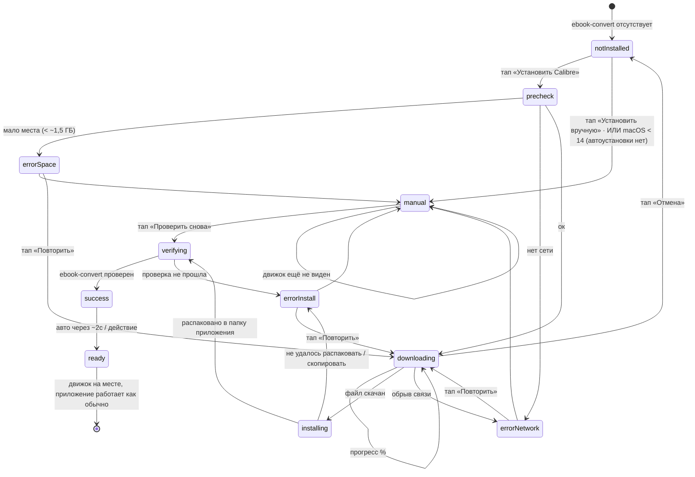

# Онбординг движка Calibre — UX-флоу и состояния

> Фича P7/P8. CJM «движок конвертации отсутствует → установлен» с максимальной
> автоматизацией. Реальный кейс: переезд на новый Mac — Calibre не установлен,
> фоновый агент загружен, но `ebook-convert` отсутствует → конвертация молча не идёт.
>
> Артефакты-макеты рядом: `direction-A-banner.html`, `direction-B-blocker.html`.
> Стиль 1-в-1 с `app/Tokens.swift` + `design/mockups/ui-native.html`.

---

## 1. Проблема (что не так сейчас)

| Экран | Сейчас | Почему плохо |
|---|---|---|
| **Status** | Выглядит почти обычно: кольцо, счётчики, бейдж «Фоновый агент Активен» (зелёный). | Врёт: агент загружен в launchd, но конвертировать нечем. Пользователь кидает книги — ничего не происходит, никакого сигнала. |
| **Setup** | Строка «ДВИЖОК» зелёная: «Calibre найден · Готов к конвертации» (`SetupView.swift:165–169` — при `calibreVersion == nil` всё равно показывает зелёное). | Прямая ложь: движка нет, а экран рапортует «готов». |
| **Настройки** | Тусклая строка «Calibre не найден · движок конвертации», без иконки-действия. | Незаметно; не объясняет, что такое движок и что делать; тупик. |

**Корень:** «есть ли движок» = `EngineClient.calibreInstalled()` (исполняемый файл
`/Applications/calibre.app/Contents/MacOS/ebook-convert`). Бейдж агента считает только
`launchctl`-загрузку и **не** учитывает движок → рассинхрон «активен, но не работает».

**Что чиним (UX):** честный, заметный сигнал на **главном экране** + одна кнопка,
которая всё делает сама (скачать → установить → проверить → оживить агента),
с полным набором состояний и ручным запасным путём.

---

## 2. Пользователь и цель

- **Кто:** обычный человек, не знает слова «Calibre». Установил приложение (или переехал
  на новый Mac), хочет, чтобы книги конвертировались.
- **Барьер:** нужен сторонний движок ≈330 МБ, вручную это «сходи на сайт, скачай DMG,
  перетащи в Программы» — половина отвалится.
- **Цель CJM:** от «конвертация молчит» до «EPUB появляются сами» — в один тап,
  не покидая приложение, без слова «Calibre» как обязательного к пониманию.

**Ключевой принцип формулировок:** ведём словами «движок конвертации» / «без него книги
не превращаются в EPUB». Имя **Calibre** — только на самой кнопке действия
(«Установить Calibre») и в подписи, чтобы человек мог сопоставить/загуглить, но
понимание не требовалось.

---

## 3. Машина состояний движка (source of truth флоу)

Техническая привязка (для арх/дева, не для человека): `notInstalled` ⇔
`calibreInstalled() == false` (проба смотрит в ОБА места — свою папку приложения и
`/Applications`, см. §8); `success/ready` ⇔ `true`. После `success` — переустановка
агента (`installer.sh` прописывает верный путь к `ebook-convert`) + `kickstart`, чтобы
watcher разобрал уже лежащие в папке книги («оживление», §7).

---

## 4. CJM: сценарий «нет движка → установлен»

**Happy path (авто):**
1. Запуск на новом Mac. Приложение видит: движка нет. **Status честно кричит** об этом
   (баннер A / блокер B), бейдж агента — не зелёный «Активен», а янтарный «Конвертация
   недоступна». Setup (если первый запуск) — тоже честный: шаг «ДВИЖОК» янтарный «не найден».
2. Человек жмёт **«Установить Calibre»**. Быстрая проверка места/сети.
3. **Скачивание** ≈330 МБ (официальный DMG по стабильному URL, curl/URLSession): прогресс
   `156 из 330 МБ · 47%`, кнопка **Отмена**.
4. **Установка**: распаковываю движок в свою папку приложения
   (`~/Library/Application Support/fb2-to-epub/calibre.app`) → проверяю. **Без пароля админа
   и без Gatekeeper-диалогов** — ставим в свою папку, дистрибутив подписан и нотаризован,
   curl не ставит карантин (`research/calibre-auto-install.md`).
5. **Успех**: зелёная галочка «Готово! Движок на месте · агент заработал». Агент оживает,
   разбирает книги из папки. Через ~2с — обычный Status, бейдж зелёный «Активен».

**Ветка «отмена»:** на шаге 3 «Отмена» → возврат в `notInstalled` (баннер/блокер снова
с кнопкой «Установить»). Скачанное — удаляется.

**Ветка «ошибка»:** нет сети / мало места / не удалось скопировать → соответствующее
сообщение + **[Повторить]** и **«Установить вручную»** (§6).

**Ветка «вручную» (fallback):** «Установить вручную» → короткая инструкция (3 шага):
открыть `calibre-ebook.com` → скачать и перетащить в «Программы» → вернуться.
Кнопки **[Открыть сайт Calibre]** и **[Проверить снова]** (ре-проба; пока не видно —
мягкое «пока не вижу движок»).

---

## 5. Точки входа (где приложение сообщает)

| Точка | Состояние «нет движка» | После установки |
|---|---|---|
| **Status (главный)** | **Напр. A:** янтарный баннер-карточка под шапкой + приглушённое кольцо/бейдж, история видна. **Напр. B:** полноэкранный блокер вместо контента (кольцо-иконка + заголовок + большая CTA). | Баннер/блокер исчезает, всё как обычно, бейдж «Активен». |
| **Настройки → строка Calibre** | Строка становится **действием**: ⚠ «Calibre не найден · движок конвертации» + кнопка **[Установить]**; во время работы — мини-прогресс + Отмена; при ошибке — **[Повторить]**. | Инфо-строка как сейчас: ✓ «Calibre 7.21 · движок конвертации» (без действия). |
| **Setup (первый запуск)** | Шаг «ДВИЖОК» — **янтарный** (`step-cur`, не зелёный): «Calibre не найден · нужен для конвертации» + CTA «Установить Calibre» / «Вручную». Приветствие: «Почти готово» вместо «Готово к работе». Футер: янтарный «Ожидает движок». Шаг «ПАПКА» остаётся зелёным. | Шаг «ДВИЖОК» зелёный: «Calibre 7.21 найден · Готов к конвертации», приветствие «Готово к работе», футер «Отслеживание активно». |

**Правило выбора A vs B — финал G2b (гибрид, не опция):** если **истории конвертаций нет**
(`state.recent.isEmpty && state.totals.convertedTotal == 0` — первый запуск / пустой переезд) →
показываем **блокер B** (показывать всё равно нечего, ведём в одно действие). Если история
есть → **баннер A** (не прячем уже сконвертированные книги пользователя). Развилка снята —
это финальное поведение. Скачивание/установка/успех/ошибка внутри выбранной подачи одинаковы.

Заметность: движок отсутствует → сигнал на **Status** (главный, а не в Настройках) —
это устраняет «молчание». Настройки и Setup несут тот же CTA для консистентности.

---

## 6. Таблица состояний компонента «Установка движка»

Единый компонент, по-разному поданный в A (баннер) и B (блокер); в Настройках — сжатая строка.

| Состояние | Триггер | Что показываем | Кнопки / действия | Отмена/недоступность |
|---|---|---|---|---|
| **empty / not-installed** | `ebook-convert` отсутствует | ⚠ оранж. Заголовок «Нет движка конвертации» + пояснение «Без него книги не превращаются в EPUB. Скачаю и поставлю сам — пара минут (≈330 МБ)» | **[Установить Calibre]** (градиент), **«Установить вручную»** (ссылка) | — |
| **loading / downloading** | тап «Установить», идёт скачивание | «Скачиваю Calibre…» + прогресс-бар `156 из 330 МБ · 47%` | **[Отмена]** | CTA заменён прогрессом (disabled) |
| **loading / installing** | файл скачан, распаковываю в папку приложения | «Устанавливаю…» + «Распаковываю движок» + индикатор (indeterminate) | нет (или Отмена disabled) | Отмена недоступна — операция неделимая |
| **loading / verifying** | скопировано, ре-проба | «Проверяю движок…» (кратко) | — | — |
| **success** | `ebook-convert` найден | ✓ emerald «Готово! Движок на месте · агент заработал — уже берусь за книги в папке» | авто-возврат в Status ~2с; в Настройках просто станет инфо-строкой | — |
| **error / network** | нет сети / обрыв | ✕ красный «Не удалось скачать. Похоже, нет интернета» | **[Повторить]**, **«Установить вручную»** | — |
| **error / space** | мало места (пре-чек ~1,5 ГБ) | ✕ «Мало места на диске. Нужно ~1 ГБ — освободи место» | **[Повторить]**, **«Вручную»** | «Установить» не запускает скачивание, сразу эта ошибка (текст «~1 ГБ» — решение D41; порог пре-чека ~1,5 ГБ — запас) |
| **error / install** | не распаковалось / не хватило места в процессе / SHA-512 не сошёлся | ✕ «Не получилось установить. Попробуй ещё раз или поставь вручную» | **[Повторить]**, **[Установить вручную]** | — |
| **manual (fallback)** | тап «Установить вручную» | «Установить вручную» + 3 шага: 1) Открой сайт Calibre 2) Скачай и перетащи в «Программы» 3) Вернись — я сам подхвачу | **[Открыть calibre-ebook.com]**, **[Проверить снова]** | «Проверить снова» → disabled на время пробы; «пока не вижу движок», если нет |
| **disabled** | во время `downloading`/`installing` | Первичная CTA неактивна (её место занял прогресс); «Проверить снова» неактивна на время пробы | — | — |

**macOS < 14 (Sonoma) — автоустановки нет.** Последний Calibre требует ≥ 14, поэтому на
старых системах (11–13) `notInstalled` ведёт **сразу в `manual`**, минуя авто-установку, а
вводная строка manual заменяется на: **«Ваша версия macOS не поддерживает автоустановку —
поставь совместимую версию с сайта»** (сайт отдаёт совместимую легаси-сборку: 7.26 до
Sonoma, 6.29 до Ventura). Отдельный экран не нужен — тот же `manual` с этой подстрокой.

**Строка Calibre в Настройках — компактные варианты:**
- not-installed: ⚠ оранж «Calibre не найден» · «движок конвертации» · **[Установить]**
- downloading: «Скачиваю… 47%» + тонкий прогресс · **[Отмена]**
- error: ✕ «Не удалось установить» · **[Повторить]**
- installed: ✓ «Calibre 7.21» · «движок конвертации» (как сейчас, без действия)

---

## 7. Автоматизация и «оживление» агента после успеха

«Максимальная автоматизация» = один тап делает всё:
1. пре-чек места (~1,5 ГБ свободно) и сети;
2. скачивание DMG (≈330 МБ, стабильный `calibre-ebook.com/dist/osx`, universal) + сверка SHA-512;
3. монтирование DMG → `ditto` `calibre.app` в `~/Library/Application Support/fb2-to-epub/` →
   размонтирование (без прав админа, без карантина);
4. проверка `ebook-convert` (в своей папке; детект видит и `/Applications/calibre.app` — ручной путь);
5. **переустановка агента** (`installer.sh` пропишет верный абсолютный путь к
   `ebook-convert`, агент стартует с голым `PATH`) + `kickstart`;
6. watcher разбирает уже лежащие в папке книги — «aha»: EPUB появляются сразу.

Текст успеха отражает именно это: «агент заработал — **уже берусь за книги в папке**».

---

## 8. Пограничные случаи и риски (трактовки PRD)

1. **Установка без трений — подтверждено research** (`research/calibre-auto-install.md`).
   Ставим `calibre.app` в свою папку (`~/Library/Application Support/fb2-to-epub/`) через
   `ditto`: НЕ нужны права админа, НЕ всплывает TCC «App Management», а скачивание
   curl/URLSession НЕ ставит `com.apple.quarantine` → Gatekeeper-диалога «Open» нет (Calibre
   подписан + нотаризован). **Пароль админа и Gatekeeper-диалоги из флоу убраны.** Остаётся
   `error/install` (не удалось распаковать/скопировать, не хватило места, SHA-512 не сошёлся).
2. **Детект движка должен смотреть в ДВА места.** Сейчас `calibreInstalled()` проверяет только
   `/Applications/calibre.app/.../ebook-convert`. Авто-установка кладёт движок в
   `~/Library/Application Support/fb2-to-epub/calibre.app`, а ручной путь (fallback) — в
   `/Applications`. Детект обязан пробовать **оба** (иначе успешная авто-установка «не
   увидится», а ручная — увидится). Правка — зона арх/дев.
3. **Бейдж агента врёт «Активен».** Нужно, чтобы бейдж и футер учитывали наличие движка,
   а не только `launchctl`. *Трактовка UX:* при `!calibreInstalled` бейдж = янтарный
   «Конвертация недоступна», футер = «Нет движка». Требует правки логики бейджа (арх/дев).
4. **Роутинг честности.** Сейчас `blockedNoCalibre`/`migratedExisting` всё равно ведут в
   зелёный Setup/Status (`main.swift:110–129`, `SetupView.swift:165–169`). Честные
   состояния (§5) + правило гибрида A/B требуют, чтобы экраны читали `calibreInstalled()` и
   `state.recent/totals` и ветвились. Это правка кода — зона арх/дев, здесь только поведение.
5. **Размер / время / закрытие окна (решено G4).** ≈330 МБ на медленном канале — минуты,
   прогресс + Отмена обязательны. **Закрытие окна НЕ прерывает загрузку** — приложение живёт
   в Dock, повторное открытие показывает текущий прогресс; **Cmd-Q** спрашивает про отмену
   загрузки. Системный Cmd-Q-диалог не макетируем (это alert ОС, не наш экран).
6. **Место на диске.** DMG (~330 МБ) + распакованный `calibre.app` → реальный пик ~1,1 ГБ;
   пре-чек в коде требует **~1,5 ГБ** свободно (запас), иначе сразу `error/space`. Снижает
   шанс падения в середине.

---

## 9. Мобильная версия

Не применимо. Это нативное окно macOS фиксированной ширины **400px** (единственный
брейкпоинт, `Tokens.M.windowWidth`). Все макеты — в 400px, тёмная тема (приложение
безусловно тёмное, `Tokens` §D10). «Desktop/mobile» из общего чеклиста здесь сводится
к одному целевому размеру.

---

## 10. Открытые вопросы к человеку (на приёмку макетов G2b)

> Решено на G2b/G4: подача — **гибрид A+B** (§5, правило по наличию истории); кнопка —
> **«Установить Calibre» + подпись «движок конвертации»**; место установки — **своя папка
> приложения** (без пароля/Gatekeeper); **закрытие окна не прерывает загрузку** (Dock, Cmd-Q
> спрашивает про отмену); **macOS < 14 → сразу ручная установка**. Остаётся один вопрос:

1. **Автопуск установки?** Никогда не качаем ≈330 МБ без явного тапа (заложено так).
   Подтвердить, что это верно (никакого авто-скачивания на старте).
